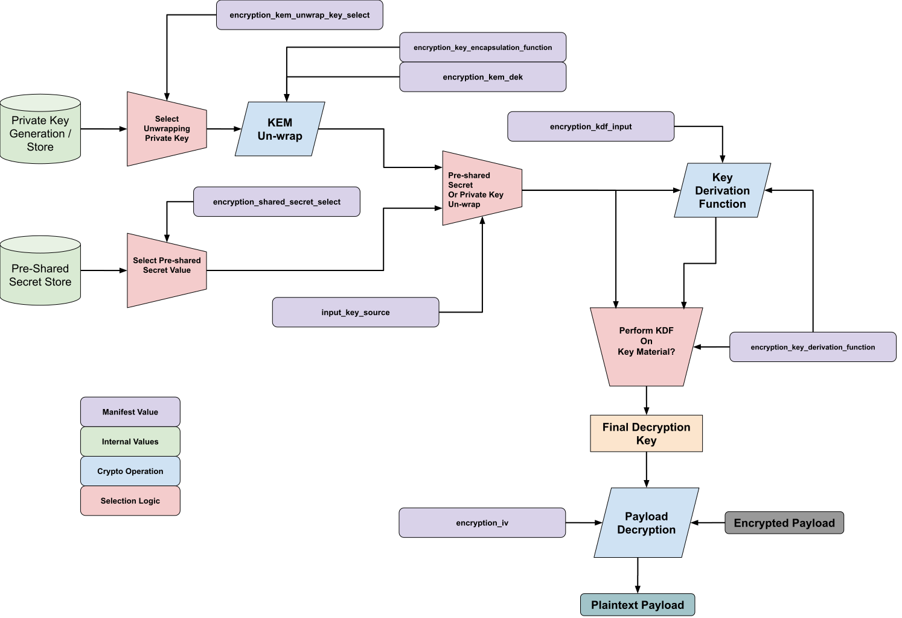
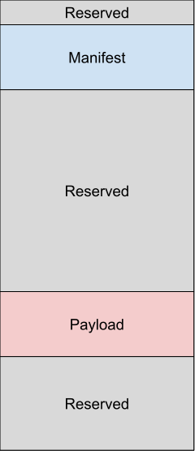
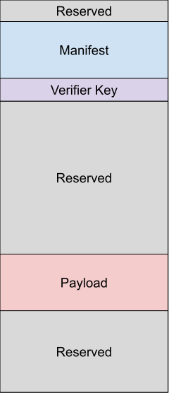
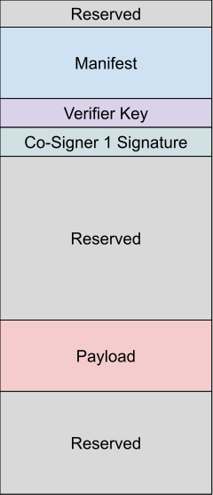
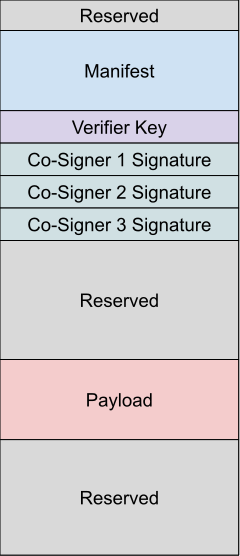

// SPDX-License-Identifier: CC-BY-4.0
// SPDX-FileCopyrightText: 2026 Tenstorrent USA, Inc.
=== Payload Manifest

The Open Chiplet Atlas boot manifest and payload structures define how deployed firmware images are organized and annotated for use in early boot applications. The manifest describes the payload including security information and usage policy. The payload contains a Table of Contents (TOC) and one, or more, images. This allows multiple images to be validated in a single operation as well as combining related firmware images into a single, deployable binary. The manifest and payload are always intended to be transmitted and processed as a paired bundle as they are tightly coupled via cryptographic metadata.

For the purposes of this document, the party that is generating manifest content for a set of payload images is hereby referred to as the *Producer*. The *Producer* is typically a chiplet / SoP / or full device owner that is generating deployable software artifacts for their platform. Conversely, the party that ingests the manifest and payload data is the *Consumer*. A *Consumer* is typically a boot ROM application, an authorized bootloader application, or validation software supplied by the *Producer*.

This manifest specification includes both byte level organizational descriptions of the various manifest components and fields as well as related parsing and validation rules. The enforcement of *Producer* and *Consumer* software behavior around the manifest values is intended to provide concrete meaning for elements that have critical integrity, authenticity, and confidentiality implications to the underlying device. An implementor not following the required manifest handling behavior may expose their system to corruption or external attack.

The security information embedded in the manifest describes how a *Consumer* can validate the integrity of the manifest and payload at runtime. Additionally, the *Consumer* of the manifest may also perform additional authentication and decryption operations against the manifest and payload if enabled by the *Producer*. These security features may be enabled/gated by device life-cycle or debug control states that the *Consumer* may need to act upon in order to complete boot operations.

All validation, authentication, and decryption operations use pre-defined cryptographic primitives described below.  

*******************************************************
[*REQ-BTMANFST-{counter:REQ_BTMANFST_IDX}*] Byte structures in this manifest format shall use little-endian byte ordering unless a specific algorithm requires otherwise. Cryptographic primitives (public keys, signatures, KEM artifacts, and hash digests) shall follow the byte ordering required by their selected algorithm and the encoding indicated in the corresponding *_encoding_* field.
*******************************************************

==== Classical and Post Quantum Cryptography

Public key cryptography is currently undergoing a series of transitions from long standing cryptographic primitives such as RSA and ECC to primitives that are thought to be more robust against attacks only possible with quantum computers. Support for Post-Quantum Computing (PQC) signatures and key exchange primitives are, thus, becoming a developing need for systems that intend to be resistant to attacks mounted with quantum computers in the future. These PQC algorithms differ radically from "classic" public key primitives and can dramatically alter the requirements of software intending to use them.

In order to balance the needs of PQC support with the need for more streamlined manifests, the OCA manifest scheme is split across PQC and non-PQC compliant systems. This creates two parallel manifest formats that differ only in their support of PQC algorithms. The two formats are:

- Classical Cryptography - only supports RSA and ECC algorithms for cryptographic signatures and Key Encapsulation Mechanisms (KEMs) for secret key exchange. This manifest format is significantly smaller on disk and requires less processing logic to fully validate and execute.
- PQC Cryptography Manifest - adds supports for PQC primitives in signature verification key encapsulation. This format is intended to be a superset of the classic manifest with all classic fields maintained at nearly all the same offsets. PQC manifests offer more cryptographic flexibility in that PQC or classic primitives can be used for signature validation and KEMs. For signature verification specifically, both classic and PQC schemes can be used to provide hybrid signature verification options for the *Producer*.

*******************************************************
[*REQ-BTMANFST-{counter:REQ_BTMANFST_IDX}*] An OCA-compliant manifest shall conform to either the classic or PQC format, as declared by _boot_manifest_magic_. Fields marked *PQC Only* are present only in the PQC format; the classic format is a distinct, shorter layout that omits them.
*******************************************************

Implementors may choose to use either the classical or PQC variants in their systems. The first manifest field, _boot_manifest_magic_, clearly labels which variant of manifest is present. A compliant OCA device acting as a *Consumer* may accept both formats at run-time or only one and reject the other. 

*******************************************************
[*REQ-BTMANFST-{counter:REQ_BTMANFST_IDX}*] An OCA manifest *Consumer* shall be able to accept at least one format; classical or PQC
*******************************************************

*******************************************************
[*OPT-BTMANFST-{counter:OPT_BTMANFST_IDX}*] Beyond the single-format minimum required above, an OCA manifest *Consumer* may accept both the classical and PQC formats at runtime.
*******************************************************

===== Managing the Post Quantum Transition

The migration from classical public key cryptography to PQC may play out over the service life of devices that are already deployed. A *Consumer* manufactured today may need to accept classical signatures at first, require both classical and PQC signatures through a hybrid period, and eventually stop honoring classical algorithms altogether. Two manifest fields exist to move a device along that path: _signature_cohort_enforce_ and _signature_class_revoke_.

The two fields both act as security ratchets, but with different intentions:

- _signature_cohort_enforce_ allows raising the *Consumer* security posture. It defines which signature cohorts, classical, PQC, or both, must be present before the *Consumer* considers each signed entity (manifest/*ROOT*, verifier key, co-signers) properly verified. Each entity carries its own setting, so the posture of the *ROOT* key, the verifier key, and individual co-signers can advance independently.
- _signature_class_revoke_ allows disabling weakened or broken signature algorithms. It specifies which algorithm classes are no longer trusted at all, whether because a class has been broken, weakened, or simply retired from the *Producer*'s portfolio. This control extends to both classical and PQC algorithms in the event attacks on PQC algorithms mature to the point of compromise.

Used together they bracket the transition: PQC signatures can be made mandatory before any classical algorithm is withdrawn, so a device is never left without a usable signature path.

Neither field participates in the parsing or verification of the manifest that carries it. They are not inputs to any check the *Consumer* performs on the current boot, other than the verifier-entry authorized-copy equality checks, which confirm the values themselves are *ROOT*-authorized rather than gating the current boot on them. Once the manifest and any appended entries have been fully verified, the values are applied to the *Consumer*'s device-side security state, where they govern how signatures are treated on subsequent boots. A *Producer* stages a posture change in one manifest and sees it take effect from the next boot onward.

Both updates are applied by OR-ing the manifest value into the device-stored value, and that state is typically held in one-time-programmable storage. Restrictions therefore only accumulate: a revoked algorithm class cannot be restored, and a cohort that has been made mandatory cannot be made optional again. Posture changes are one-way and are expected to be staged deliberately.

Each half of _signature_class_revoke_ carries a group code byte alongside its per-algorithm class bits — 0xCA for the classical group and 0xAC for the PQC group. A group code is a single constant, not a bitmask, and only its exact value carries meaning. This is what makes disabling an entire group an explicit act rather than something a device can accumulate its way into.

[NOTE]
====
A *Consumer* evaluating whether a whole group has been disabled should compare the complete group code byte against the constant rather than testing individual bits within it. Because the device-side register accumulates by OR, a partially set group code byte is not a partial revocation and carries no meaning on its own.

A group-wide disable is reachable only through the group code. Even when every per-algorithm class bit in a group is set, the group is not wholly disabled unless the constant is intact. Concretely: on a device where every classical class except RSA has already been revoked, RSA can only be revoked by an update that also sets 0xCA. The group code is the *Producer*'s explicit acknowledgement that no algorithm in that group will remain usable.
====

This interlock matters because the device-side state is monotonic and OTP-backed. Without it, a sequence of individually reasonable revocations could walk a device into a state where no signature algorithm remains for a group — permanently, and with no single manifest having declared that intent.

Because the device-side register accumulates by OR, the interlock only holds if no manifest ever carries a fragment of a group code: fragments from separate manifests would otherwise accumulate into an intact constant that no single manifest declared.

*******************************************************
[*REQ-BTMANFST-{counter:REQ_BTMANFST_IDX}*] The *Producer* shall populate the classical group code byte (b[15:8]) of _signature_class_revoke_ with exactly 0x00 or exactly 0xCA, and the PQC group code byte (b[39:32]) with exactly 0x00 or exactly 0xAC. The same restriction applies to _verifier_authorized_signature_class_revoke_ in the verifier key entry. The *Consumer* shall reject any manifest or verifier key entry carrying any other value in a group code byte.
*******************************************************

The group code restriction keeps accumulation honest but does not keep a device bootable: a manifest may legitimately carry both intact group codes, and OR-ing both into OTP-backed storage while secure boot is enforced leaves the device permanently unable to verify any manifest. Guarding against that end state is *Consumer* security policy. The *Consumer* should reject any manifest whose _signature_class_revoke_ update would leave both group codes wholly disabled in the device-stored state while secure boot remains enforced, unless a vendor-defined decommissioning control explicitly authorizes entering that state.

A group revocation also overrides enforcement. Once a group code has marked a group as wholly disabled, the *Consumer* ignores that group's bits in _signature_cohort_enforce_ for every entity. With all classical algorithms disabled, the classical enforcement bit for the manifest/*ROOT*, for the verifier key, and for each co-signer carries no meaning — no classical algorithm remains that could satisfy it. Revocation is the stronger statement of the two and takes precedence.

Ignoring an enforcement bit does not make signature verification optional. It withdraws a device-side demand for a cohort that no longer exists; it does not relax _secure_boot_control_, and a manifest whose signatures rely on a revoked algorithm class still fails verification. The surviving group's enforcement bits continue to apply unchanged. This is the reason a *Producer* is expected to make the surviving cohort mandatory before revoking the group it replaces — the enforcement bit for the group being retired stops carrying weight the moment that group is disabled.

Enforcement of the accumulated device-side state at boot time is *Consumer* security policy rather than manifest interoperability, so it is expressed here as strongly recommended policy instead of formal requirements. Both registers are inert unless the *Consumer* consults them during every secure boot:

- The *Consumer* should reject any required signature — manifest, verifier entry, or co-signer — whose algorithm belongs to a class disabled in the device-stored signature-class revocation state, whether by the class's individual per-algorithm bit or by an intact group code.
- For each signed entity engaged by the manifest bundle, the *Consumer* should require every signature cohort demanded by the device-stored enforcement bits for that entity, using the per-entity bit assignments defined for _signature_cohort_enforce_.
- The *Consumer* should ignore enforcement bits for an entity not engaged by the current bundle: a verifier key entry that is not appended or a co-signer slot that is not enabled.
- The *Consumer* should ignore enforcement bits for a signature group wholly disabled by its group code.

A *Consumer* that applies the OR-in updates but never consults the accumulated state receives no security benefit from either register: the fuses record a posture the device never adopts, and a manifest relying on a broken or retired algorithm class continues to verify exactly as it did before the *Producer* staged the change.

==== Manifest Format
// Fields in this manifest all have names without spaces and use _ as a separator.  They are all lowercase
// with the goal of these names being used directly in software that implements manifest/payload processing.

The following table describes the byte level format for the top-level manifest structure (before any additional payload or verification-related entries) as a set of delineated byte fields.

*******************************************************
[*REQ-BTMANFST-{counter:REQ_BTMANFST_IDX}*] The on-disk byte layout of the manifest is fixed at the offsets implied by the order of fields in the manifest table. The *Producer* shall pack fields back-to-back in the order shown, without gaps or additional padding beyond the explicit `reserved` entries enumerated in the table. The *Consumer* shall locate fields by their fixed offset from the start of the manifest and shall not rely on any in-band length, type, or tag prefixes for the fields themselves. Reordering, omitting, or inserting fields outside what the table specifies is a format violation and the *Consumer* shall reject any such manifest.
*******************************************************

*******************************************************
[*REQ-BTMANFST-{counter:REQ_BTMANFST_IDX}*] For every field, the *Producer* and *Consumer* shall honor the size, *Signed*, *PQC Only*, and *Secure Boot Only* characteristics defined for that field in the Software Payload Manifest table.
*******************************************************

The tables fields are as follows:

* *Field Name* - intended reference name for a particular byte field when used in manifest generation and consumption software tooling
* *Size (bytes)* - size in bytes of the field when the full manifest is stored on-disk
* *Flags* - the attributes that apply to the field, shown as a comma-separated list (or — when none apply):
** *Signed* - the field is included when calculating integrity and authentication checks such as cryptographic hashes and signatures
** *PQC* - the field is only present in the Post-Quantum Cryptography compatible variant of the OCA manifest. Field cells are additionally color coded (when possible) to indicate manifest membership:
*** [.classic-bg]#Light Green cells# being included in both classical and PQC manifests
*** [.pqc-bg]#Light Purple cells# being included in ONLY PQC manifests
** *SB* - "Secure Boot only": the field is only interpreted and validated when secure boot is enabled. All fields remain logically present at their fixed offset regardless; SB fields are zeroed-or-ignored when secure boot is disabled. (See <<boot_manifest_secure_boot, Secure Boot>> for details on when this may be enabled)

[NOTE]
Sizes shown as "N/M" in the Size column are variant-specific: N is the size in the Classic manifest, M is the size in the PQC manifest.

[[tab:software_payload_manifest]]
.Software Payload Manifest
[width="100%",cols="24%,7%,14%,55%",options="header"]
[grid=rows]
[frame=ends]
|===
|*Field* |*Size (bytes)* |*Flags* |*Description*

|{set:cellbgcolor:#d4edda}boot_manifest_magic
|4
|Signed
a|Fixed ASCII Characters (no null terminator) to indicate the start of a manifest block

* "OCAC" - Open Chiplet Atlas with Classic Signature Support
* "OCAP" - Open Chiplet Atlas with Post-Quantum Signature Support

All other values are invalid.

|{set:cellbgcolor:#d4edda}manifest_identifier
|8
|Signed
a|The _manifest_identifier_ is used to identify which boot stage payload this manifest describes. This value should be an 8 character ASCII string so that hex renderings of a manifest can be identified visually.

Character content is vendor defined

|{set:cellbgcolor:#d4edda}manifest_version_major
|2
|Signed
|Major version of the manifest format that the manifest conforms to. Current major
version is 1. Changes to the major version indicate a change that is not backwards
compatible. If the major version number in a manifest is greater than the major
version for which the software was designed to use the software will reject the
manifest. Old software can correctly use a format that only differs by having a larger
minor version than it was designed to work with.

|{set:cellbgcolor:#d4edda}manifest_version_minor
|2
|Signed
|Minor version of the manifest format. Current minor version is 0.

|{set:cellbgcolor:#d4edda}manifest_length
|4
|Signed
|Length of the manifest in bytes.
Classical Signature Manifest version 1.0 is 4096 bytes.
Post Quantum Signature Manifest version 1.0 is 36864 bytes.
The manifest will always be a multiple of 2048 bytes in length. This ensures proper alignment of fields when manifests are written to or cleared from some forms of flash memory with large default block sizes.

|{set:cellbgcolor:#d4edda}reserved
|4
|Signed
|Shall be 0x00

|{set:cellbgcolor:#d4edda}selector_bits
|16
|Signed
a|This field, along with the following nine fields, is used to constrain a boot stage
payload to a set of devices based on their device IDs, creator, manufacturing
states, life cycle states, and/or device revision information. 

Bits of this field determine which additional fields (or individual
bytes or bits of a field) shall be read from the hardware during verification.
Unselected bytes in each _DEVICE_id_ shall be set to *MANIFEST_UNUSED_BYTE
(0xA5)* to be able to generate a consistent value during verification.

Unselected single and multi-bit fields in _lifecycle_DEVICE_states_ shall be set to 0x0 to be able to generate a consistent value during verification.

* Bit[31:0] are mapped to bytes 31-0 of _chiplet_id_, bit 0 <→ byte 0, …, bit 31 <→ byte 31
* Bit[63:32] are mapped to bytes 31-0 of _package_id_, bit 32 <→ byte 0, …, bit 63  <→ byte 31
* Bit[95:64] are mapped to bytes 31-0 of _system_id_, bit 64 <→ byte 0, …, bit 95 <→ byte 31
* Bit[96] is mapped to vendor specific chiplet lifecycle states verification. If this bit is 0 then no lifecycle checking is done for the chiplet and this manifest will load without any chiplet lifecycle state checks.
* Bit[97] is mapped to vendor specific package lifecycle states verification. If this bit is 0 then no lifecycle checking is done for the package and this manifest will load without any package lifecycle state checks.
* Bit[98] is mapped to vendor specific system lifecycle states verification. If this bit is 0 then no lifecycle checking is done for the host system and this manifest will load without any system lifecycle state checks.
* Bit[99] - Enable Chiplet Minimum Version Check. 
* Bit[100] - Enable Chiplet Maximum Version Check. 
* Bit[101] - Enable Package Minimum Version Check.
* Bit[102] - Enable Package Maximum Version Check.
* Bit[103] - Enable System Minimum Version Check.
* Bit[104] - Enable System Maximum Version Check.
* Bit[127:105] are reserved and shall be 0x0

|{set:cellbgcolor:#d4edda}chiplet_id
|32
|Signed
|Chiplet identifier value - Vendor Defined Pattern Mapped to low bits in _selector_bits_

|{set:cellbgcolor:#d4edda}package_id
|32
|Signed
|Integrator package identifier value - Vendor Defined Pattern Mapped to middle bits in _selector_bits_

|{set:cellbgcolor:#d4edda}system_id
|32
|Signed
|System level identifier value - Vendor Defined Pattern Mapped to high bits in _selector_bits_

|{set:cellbgcolor:#d4edda}lifecycle_chiplet_states
|4
|Signed
|Chiplet Lifecycle Control - Vendor defined field to determine whether this image should be used based on the lifecycle state of the chiplet. Checking of these states is enforced with Bit[96] in _selector_bits_.

|{set:cellbgcolor:#d4edda}lifecycle_package_states
|4
|Signed
|Package Lifecycle Control - Vendor defined field to determine whether this image should be used based on the lifecycle state of the host package containing the chiplet. Checking of these states is enforced with Bit[97] in _selector_bits_.

|{set:cellbgcolor:#d4edda}lifecycle_system_states
|4
|Signed
|System Lifecycle Control - Vendor defined field to determine whether this image should be used based on the lifecycle state of the host system containing the overall SoP. Checking of these states is enforced with Bit[98] in _selector_bits_.

|{set:cellbgcolor:#d4edda}version_range_chiplet
|8
|Signed
a|Chiplet version range value.
Uses a 2-byte value for major and minor version fields and specifies a minimum and maximum value

* Byte[1:0] Minor Version Minimum
* Byte[3:2] Major Version Minimum
* Byte[5:4] Minor Version Maximum
* Byte[7:6] Major Version Maximum

Chiplet version range checking can be enforced by the *Producer* via _selector_bits_ Bit[100:99].

|{set:cellbgcolor:#d4edda}version_range_package
|8
|Signed
a|Package version range value.
Uses a 2-byte value for major and minor version fields and specifies a minimum and maximum value

* Byte[1:0] Minor Version Minimum
* Byte[3:2] Major Version Minimum
* Byte[5:4] Minor Version Maximum
* Byte[7:6] Major Version Maximum

Package version range checking can be enforced by the *Producer* via _selector_bits_ Bit[102:101].

|{set:cellbgcolor:#d4edda}version_range_system
|8
|Signed
a|System version range value.
Uses a 2-byte value for major and minor version fields and specifies a minimum and maximum value

* Byte[1:0] Minor Version Minimum
* Byte[3:2] Major Version Minimum
* Byte[5:4] Minor Version Maximum
* Byte[7:6] Major Version Maximum

System version range checking can be enforced by the *Producer* via _selector_bits_ Bit[104:103].

|{set:cellbgcolor:#d4edda}demotion_control
|2
|Signed
a|Demotion Control - Vendor defined demotion enforcement flags to modify device behavior when preparing to boot the provided images. Intended to protect device operation / secrets from debug or RMA focused payloads. 

* Bit[7:0] - _demotion_control_0-7_ - Vendor defined demotion control bit flags
* Bit[15:8] RESERVED: Shall be zero

|{set:cellbgcolor:#d4edda}reserved
|8
|Signed
|Shall be 0x00

|{set:cellbgcolor:#d4edda}secure_boot_control
|1
|Signed
a|Secure Enable Control - Enforce secure boot authentication checks and related logic
For PQC manifests, _secure_boot_classic_ and _secure_boot_pqc_ may be set in any combination; when secure boot is enabled, at least one shall be set. For classic manifests, _secure_boot_pqc_ shall be b0

Secure boot verification of the manifest and payload artifacts can be enforced through other means (device life-cycle, vendor defined authenticated and unauthenticated flags, etc) so these bits are not the definitive check for vendor level secure boot enforcement

* Bit[0] - _secure_boot_enforced_: Enables secure boot checks. May be overridden by device life-cycle checks or internal configuration.
* Bit[1] - _secure_boot_classic_: Enforce classic manifest signature check if secure boot is enabled. Implies a classic public key and signature are available in _public_key_classic_ and _signature_classic_ respectively. May be ignored only when _secure_boot_enforced_ is b0 AND no device life-cycle state or other vendor-defined security control has independently enabled secure boot.
* Bit[2] - _secure_boot_pqc_: Enforce PQC Manifest Signature Validation if secure boot is enabled. Implies a PQC public key and signature are available in _public_key_pqc_ and _signature_pqc_ respectively. May be ignored only when _secure_boot_enforced_ is b0 AND no device life-cycle state or other vendor-defined security control has independently enabled secure boot. Only valid for OCA PQC manifest: Shall be b0 for classic manifest
* Bit[7:3] RESERVED: Shall be zero

|{set:cellbgcolor:#d4edda}reserved
|8
|Signed
|Shall be 0x00

|{set:cellbgcolor:#d4edda}manifest_security_control
|2
|Signed, SB
a|Manifest Security Control - Enforcement Flags Related to Manifest, Payload, and Boot Security

All six bits in this control field are opt-OUT *disable* flags. The default behavior of a *Consumer* that has successfully verified the manifest is to automatically advance the corresponding device-side security state to reflect the manifest contents. Each flag suppresses one of those automatic updates.

* Bit[0] - _manifest_security_version_update_disable_: When set, the *Consumer* shall NOT update the device-side manifest security version. In its absence, the *Consumer* ORs _manifest_security_version_ from this manifest into the device-stored value (typically One-Time-Programmable fuses). Because the manifest security version bitmask check has already enforced that _manifest_security_version_ is a bit-superset of the device value, this OR-in operation only sets bits that are 0 in the device — the only direction OTP can be programmed. Only respected when secure boot is enabled.
* Bit[1] - _manifest_revoke_keys_disable_: When set, the *Consumer* shall NOT update the device-side ROOT key revocation state. In its absence, the *Consumer* ORs the values from _public_key_classic_revoke_ (and _public_key_pqc_revoke_ if a PQC manifest is being used) into the device-stored revocation state. Only respected when secure boot is enabled.
* Bit[2] - _verifier_security_update_disable_: When set, the *Consumer* shall NOT update the device-side verifier security version. In its absence, the *Consumer* ORs _verifier_security_version_ from the main manifest into the device-stored value. Because the verifier security version bitmask check has already enforced that _verifier_security_version_ is a bit-superset of the device value, this OR-in operation only sets bits that are 0 in the device. Only respected when secure boot is enabled.
* Bit[3] - _verifier_revoke_keys_disable_: When set, the *Consumer* shall NOT update the device-side verifier-key revocation state. In its absence, the *Consumer* ORs the value from _verifier_key_id_revoke_ in this manifest into the device-stored verifier revocation state. Independent of _manifest_revoke_keys_disable_ — that flag covers ROOT keys, this flag covers verifier keys. Only respected when secure boot is enabled.
* Bit[4] - _signature_cohort_enforce_update_disable_: When set, the *Consumer* shall NOT update the device-side signature cohort enforcement state. In its absence, the *Consumer* ORs the value from _signature_cohort_enforce_ in this manifest into the device-stored signature cohort enforcement state. Only respected when secure boot is enabled.
* Bit[5] - _signature_class_revoke_update_disable_: When set, the *Consumer* shall NOT update the device-side signature class revocation state. In its absence, the *Consumer* ORs the value from _signature_class_revoke_ in this manifest into the device-stored signature class revocation state. Only respected when secure boot is enabled.
* Bit[15:6] RESERVED: Shall be zero

*Note* For all six automatic updates, the timing and execution of the update operation is implementation dependent, but shall only happen after the manifest has been authenticated with all required signature checks. This includes the primary manifest signature, verifier key entry signature, and co-signer entries where appropriate.

|{set:cellbgcolor:#d4edda}reserved
|8
|Signed
|Shall be 0x00

|{set:cellbgcolor:#d4edda}payload_encryption_control
|2
|Signed, SB
a|Payload Encryption Control Flags

Encryption Control Flags:

* Bit[0] - _encrypted_payload_: Payload is Encrypted and shall be decrypted using _encryption_type_ to move forward in the boot process. Only respected when secure boot is enabled.
* Bit[2:1] - RESERVED
* Bit[5:3] - _input_key_source_: Selects the source of the input key fed to either the KDF or (when no KDF is used) the payload cipher directly. Mutually exclusive — exactly one source may be selected per manifest.
** b001 - pre-shared secret selected by _encryption_shared_secret_select_
** b010 - DEK unwrapped from _encryption_kem_dek_ using the private decapsulation key selected by _encryption_kem_unwrap_key_select_ and the algorithm in _encryption_key_encapsulation_function_
** All other values reserved
* Bit[15:6] RESERVED: Shall be zero

|{set:cellbgcolor:#d4edda}encryption_key_derivation_function
|2
|Signed, SB
a|Key Derivation Function - the method to securely generate the payload decryption key from either a shared secret value or unwrapped DEK using the _encryption_kdf_input_ as a seed. Applying a KDF to a pre-shared secret allows for all encryption operations to, theoretically, be unique if _encryption_kdf_input_ is randomized per manifest. Alternatively, applying the KDF to the unwrapped DEK allows for an additional layer of protection on the payload if the DEK is re-used between payloads. 

* 0x0000: NONE: Use input key (selected shared secret or unwrapped DEK) directly as payload decryption key (_encryption_kdf_input_ is ignored). Not compatible with CBC-HMAC encryption types
* 0x0001: NIST SP 800-108r1 Counter Mode (HMAC-SHA-256)
* 0x0002: NIST SP 800-108r1 Counter Mode (HMAC-SHA-512)
* 0x0003: NIST SP 800-108r1 Counter Mode (HMAC-SHA3-256)
* 0x0004: NIST SP 800-108r1 Counter Mode (HMAC-SHA3-512)
* 0x0005: NIST SP 800-108r1 Counter Mode (CMAC-AES-128)
* 0x0006: NIST SP 800-108r1 Counter Mode (CMAC-AES-256)
* 0x0007: NIST SP 800-108r1 KMAC Mode (KMAC-256)
* 0x0008: RFC 5869 (HKDF SHA-256)
* 0xFF00-0xFFFF: Integrator Implementation Defined
* All other values reserved

|{set:cellbgcolor:#d4edda}encryption_shared_secret_select
|2
|Signed, SB
a|Shared Secret Select: selection bits for which of the available pre-shared secret should be used as key input to the selected KDF function. Pre-shared secrets are data that have been secure provisioned in the device by a trusted party. Access to shared secrets should be highly restricted. Devices are not required to have the full complement of eight secrets available and may consider some bit configurations reserved.

* 0x0001: shared_secret_1
* 0x0002: shared_secret_2
* 0x0003: shared_secret_3
* 0x0004: shared_secret_4
* 0x0005: shared_secret_5
* 0x0006: shared_secret_6
* 0x0007: shared_secret_7
* 0x0008: shared_secret_8
* All other values reserved

|{set:cellbgcolor:#d4edda}reserved
|16
|Signed
|Shall be 0x00

|{set:cellbgcolor:#d4edda}encryption_kem_unwrap_key_select
|2
|Signed, SB
a|KEM Unwrapping  Key Select: Choose which of the available device private keys should be used to unwrap _encryption_kem_dek_ using the method prescribed in _encryption_key_encapsulation_function_. The unwrapping key should be an asymmetric private key available to the device, but access is highly restricted. Devices are not required to have the full complement of eight private keys available and may consider some bit configurations vendor reserved.

* 0x0001: dek_unwrap_key_0
* 0x0002: dek_unwrap_key_1
* 0x0003: dek_unwrap_key_2
* 0x0004: dek_unwrap_key_3
* 0x0005: dek_unwrap_key_4
* 0x0006: dek_unwrap_key_5
* 0x0007: dek_unwrap_key_6
* 0x0008: dek_unwrap_key_7
* All other values reserved

|{set:cellbgcolor:#d4edda}encryption_key_encapsulation_function
|2
|Signed, SB
a|Key Encapsulation Function: Algorithm used to wrap _encryption_kem_dek_ using a specific public key. The decapsulation method will be used with the private key specified by _encryption_kem_unwrap_key_select_ to produce the unwrapped DEK.

* 0x0001: ECDHE-P256+AES-KW-256
* 0x0002: ECDHE-P384+AES-KW-256
* 0x0003: ECDHE-X25519+AES-KW-256
* 0x0004: RSA-OAEP - RSA-3072
* 0x0005: RSA-OAEP - RSA-4096
* 0x0101: ML-KEM-768 (PQC Manifest Only - Reserved in Classic Manifest)
* 0x0102: ML-KEM-1024 (PQC Manifest Only - Reserved in Classic Manifest)
* 0xFF00-0xFFFF: Integrator Implementation Defined
* All other values reserved

|{set:cellbgcolor:#d4edda}reserved
|8
|Signed
|Shall be 0x00

|{set:cellbgcolor:#d4edda}encryption_iv
|32
|Signed, SB
|Encryption Initialization Vector. For encryption modes that do not require the entire IV, only the lowest necessary bytes are populated by the *Producer* with IV material; all other bytes shall be populated as 0x00 by the *Producer*. Only valid when _encrypted_payload_==1.

|{set:cellbgcolor:#d4edda}reserved
|8
|Signed
|Shall be 0x00

|{set:cellbgcolor:#d4edda}encryption_kdf_input
|64
|Signed, SB
|Key Derivation Function’s input to derive the key used for encryption. Only valid when
_encrypted_payload_==1.

|{set:cellbgcolor:#d4edda}reserved
|8
|Signed
|Shall be 0x00

|{set:cellbgcolor:#d4edda}encryption_kem_dek
|1600
|Signed, SB
a|KEM-Encrypted Data Encryption Key (DEK)

When the following conditions are met:

* secure boot is enabled on device
* payload encryption is enabled via _encrypted_payload_
* key de-capsulation is enabled via _input_key_source_ being set to b010 and _encryption_key_encapsulation_function_ and _encryption_kem_unwrap_key_select_ holding valid values

This field will contain the encapsulated DEK that may be unwrapped using a private key owned by the device. It is sized for the largest selectable KEM, ML-KEM-1024. For smaller KEMs, all unused bytes shall be 0x00.

Unlike _signature_*_ and _public_key_*_, _encryption_kem_dek_ has no companion _encoding_ field; its byte layout is determined entirely by the selected _encryption_key_encapsulation_function_ value. For the ML-KEM key-encapsulation functions the field holds the KEM ciphertext directly. The exact byte layout of this field for the ECDHE+AES-KW and RSA-OAEP key-encapsulation functions (_encryption_key_encapsulation_function_ values 0x0001–0x0005) is TBD and will be defined in a future revision of this specification.

|{set:cellbgcolor:#d4edda}reserved
|64
|Signed
|Shall be 0x00

|{set:cellbgcolor:#d4edda}verifier_key_control
|1
|Signed, SB
a|Verifier Key Control - enables the use of a verifier key to validate the manifest and payload. Allows for authorized, chained signing of manifests by a second party

* Bit[0] - _use_verifier_key_: Manifest is signed using a secondary verifier key. The classic/PQC public key(s) in the manifest are now the *ROOT* key(s) that will validate the *VERIFIER* key entry.
If this bit is set, then 2048 or 34816 bytes of verifier key material is available immediately after the normal manifest (based on if the manifest type is classical or PQC)
Only respected when secure boot is enabled.

* Bit[7:1] RESERVED: Shall be zero

|{set:cellbgcolor:#d4edda}reserved
|8
|Signed
|Shall be 0x00

|{set:cellbgcolor:#d4edda}co_signer_control
|2
|Signed, SB
a|Co-signer Enable - Enable up to 8 co-signers that sign the overall manifest. All enabled co-signer signatures shall be found and verified before the boot process can complete
Only available when secure boot is enabled.

* Bit[7:0] _co_signer_enable_
** b[0]: Co-signer 1 Enabled
** b[1]: Co-signer 2 Enabled
** b[2]: Co-signer 3 Enabled
** b[3]: Co-signer 4 Enabled
** b[4]: Co-signer 5 Enabled
** b[5]: Co-signer 6 Enabled
** b[6]: Co-signer 7 Enabled
** b[7]: Co-signer 8 Enabled
* Bit[15:8] RESERVED: Shall be zero

|{set:cellbgcolor:#d4edda}reserved
|4
|Signed
|Shall be 0x00

|{set:cellbgcolor:#d4edda}feature_control
|8
|Signed
a|Vendor Feature Flags

* Bit[63:0] - feature_control_0-63: Vendor defined flags for enabling or disabling features. May be used for mode setting and debug control during or after boot.

|{set:cellbgcolor:#d4edda}reserved
|8
|Signed
|Shall be 0x00

|{set:cellbgcolor:#d4edda}manifest_security_version
|16
|Signed, SB
a|Security version of the manifest used for anti-rollback protection. Only valid when boot is secure. By default, after the manifest has been verified, the value in this field is OR'd into the vendor-specific hardware manifest security version (setting any bits that are 1 in the manifest and 0 on the device); this automatic update is suppressed when _manifest_security_version_update_disable_ in _manifest_security_control_ is set.

When a verifier key entry is appended, this field is also subject to the _verifier_security_controls_ gating REQ via _verifier_authorized_manifest_security_version_ in the verifier entry.

|{set:cellbgcolor:#d4edda}encryption_type
|1
|Signed, SB
a|Encryption algorithm used to protect confidentiality of payload contents (TOC + images). Only valid when _encrypted_payload_ == 1; ignored otherwise.

* 0x01: AES-128-CBC
* 0x02: AES-256-CBC
* 0x03: AES-128-CBC-HMAC-SHA256
* 0x04: AES-256-CBC-HMAC-SHA256
* 0x05: AES-128-GCM-SIV
* 0x06: AES-256-GCM-SIV
* 0x11: SM4-128-CBC
* 0x12: SM4-128-CBC-HMAC-SHA256
* 0x13: SM4-128-GCM-SIV
* 0xF0-0xFF: Integrator implementation defined
* All other values: reserved

|{set:cellbgcolor:#d4edda}reserved
|8
|Signed
|Shall be 0x00

|{set:cellbgcolor:#d4edda}manifest_hash_type
|1
|Signed
a|Hashing algorithm used To calculate _manifest_hash_ field - value may differ from digest type used in secure boot signatures defined in _signature_type_classic_ and _signature_type_pqc_.

* 0x01 SHA2-256
* 0x02 SHA2-384
* 0x03 SHA2-512
* 0x04 SHA3-256
* 0x05 SHA3-384
* 0x06 SHA3-512
* 0x07 SHAKE256-256
* 0x08 SHAKE256-512
* All other values reserved

|{set:cellbgcolor:#d4edda}reserved
|8
|Signed
|Shall be 0x00

|{set:cellbgcolor:#d4edda}signature_cohort_enforce
|8
|Signed, SB
a|Classical and/or PQC signature enforcement device control register. Only valid when boot is secure. Specifies which groups of signature algorithms (classical or PQC) must be present for secure verification of each of the main signed entities (manifest/ROOT, verifier key, co-signers). This allows each verification entity to set their security posture independently. By default, after the manifest has been verified, the value in this field is OR'd into the vendor-specific hardware signature enforcement register. This automatic update is suppressed when _signature_cohort_enforce_update_disable_ in _manifest_security_control_ is set.

For each entity, four bits are assigned as follows:

* bit 0 = classical (ECC or RSA) signature must be present
* bit 1 = post-quantum (ML-DSA, FN-DSA, SLH-DSA) signature must be present
* bit[3:2] reserved.

The per-entry control bits are as follows:

* b[3:0]: Signatures produced by the *ROOT* key: the manifest signature(s) when no verifier entry is present, or the verifier-entry signature(s) when one is appended
* b[7:4]: Manifest signature(s) produced by the verifier key. Only meaningful when _use_verifier_key_ is set
* b[11:8]: Co-Signer 1 Signatures. Only meaningful when _co_signer_enable_ is set appropriately 
* b[15:12]: Co-Signer 2 Signatures
* b[19:16]: Co-Signer 3 Signatures
* b[23:20]: Co-Signer 4 Signatures
* b[27:24]: Co-Signer 5 Signatures
* b[31:28]: Co-Signer 6 Signatures
* b[35:32]: Co-Signer 7 Signatures
* b[39:36]: Co-Signer 8 Signatures
* All other bits: RESERVED

|{set:cellbgcolor:#d4edda}signature_class_revoke
|8
|Signed, SB
a|Signature algorithm revocation control register. Only valid when boot is secure. Specifies which groups or classes of signature algorithms should no longer be respected for secure verification. This includes verification of the manifest, verifier and co-signer PQC and classical signatures. Each class can represent one or more algorithms that are closely related such that a break in one most likely represents a break in all. Allows the implementor of the *Consumer* to modify the security posture of the device by disabling any compromised algorithms. By default, after the manifest has been verified, the value in this field is OR'd into the vendor-specific hardware signature revocation storage register. This automatic update is suppressed when _signature_class_revoke_update_disable_ in _manifest_security_control_ is set.

* b[0]: RSA-3072 Algorithms are Disabled
* b[1]: RSA-4096 Algorithms are Disabled
* b[2]: NIST P-256 ECDSA is Disabled
* b[3]: NIST P-384 ECDSA is Disabled
* b[4]: NIST P-521 ECDSA is Disabled
* b[5]: Ed25519 EdDSA is Disabled
* b[6]: Ed448 EdDSA is Disabled
* b[7]: System Integrator Classical Signature Implementations are Disabled
* b[15:8]: All Classical Signatures are Disabled if set to 0xCA
* b[23:16]: RESERVED
* b[24]: FIPS 204 ML-DSA-44 is Disabled
* b[25]: FIPS 204 ML-DSA-65 is Disabled
* b[26]: FIPS 204 ML-DSA-87 is Disabled
* b[27]: Reserved for FIPS 206 FN-DSA
* b[28]: FIPS 205 SLH-DSA-128 Algorithms are Disabled
* b[29]: FIPS 205 SLH-DSA-192 Algorithms are Disabled
* b[30]: FIPS 205 SLH-DSA-256 Algorithms are Disabled
* b[31]: System Integrator PQC Signature Implementations are Disabled
* b[39:32]: All PQC Signatures are Disabled if set to 0xAC
* All other bits: RESERVED

|{set:cellbgcolor:#d4edda}signature_type_classic
|1
|Signed, SB
a|Classical signature algorithm for secure boot verification of manifest (or verifier key entry). Includes any padding / hash specifications required for the algorithm. Ignored when boot is not secure or when  _secure_boot_classic_ is not set.

* 0x01: RSA-3072, RSASSA-PKCS1-v1_5, SHA-256
* 0x02: RSA-3072, RSASSA-PSS, SHA-256
* 0x03: RSA-4096, RSASSA-PKCS1-v1_5, SHA-512
* 0x04: RSA-4096, RSASSA-PSS, SHA-512
* 0x05: NIST ECC-P256, SHA2-256
* 0x06: NIST ECC-P384, SHA2-384
* 0x07: NIST ECC-P521, SHA2-512
* 0x0A: Ed25519 (HashEdDSA)
* 0x0B: Ed448 (HashEdDSA SHAKE256x64)
* 0xF0-0xFF: System Integrator Implementation Defined
* All other values: RESERVED

|{set:cellbgcolor:#d4edda}signature_encoding_classic
|1
|Signed, SB
a|Define how the classical signature data in the _signature_classic_ field is encoded

* 0x01 - ASN.1 DER Encoded - RFC 3279 ECDSA-Sig-Value SEQUENCE { r INTEGER, s INTEGER }. Legal only for the ECDSA _signature_type_classic_ values (0x05 - 0x07).
* 0x02 - Raw Bytes - algorithm-native byte order.
* 0xF0-0xFF: System Integrator Implementation Defined
* All other values: RESERVED

|{set:cellbgcolor:#d4edda}signature_size_classic
|2
|Signed, SB
|The number of valid bytes in _signature_classic_ as determined by the selected algorithm and encoding. For ASN.1 DER ECDSA signatures this holds the algorithm's maximum DER length and the actual length is given by the DER length octets.

|{set:cellbgcolor:#d4edda}reserved
|8
|Signed
|Shall be 0x00

|{set:cellbgcolor:#d4edda}public_key_select_classic
|16
|Signed, SB
a|Classic public key selection. This field delineates the authorized public keys that can be used to verify the manifest or verifier key signature when secure boot is enabled. The field is a bit mask that allows 1 to 112 keys to be selected as authorized. Keys are logically grouped into 7 different groups.

* Bit[15:0] Group 1 Public Key Authorization Flags
* Bit[31:16] Group 2 Public Key Authorization Flags
* Bit[47:32] Group 3 Public Key Authorization Flags
* Bit[63:48] Group 4 Public Key Authorization Flags
* Bit[79:64] Group 5 Public Key Authorization Flags
* Bit[95:80] Group 6 Public Key Authorization Flags
* Bit[111:96] Group 7 Public Key Authorization Flags
* Bit[127:112] RESERVED

|{set:cellbgcolor:#d4edda}public_key_classic
|532
|Signed, SB
|classic public key used for authentication of the manifest or verifier key signature. This field is sized to support the maximum size key, which is an RSA-4096 PKCS#1 RSAPublicKey ASN.1 DER structure at 523 bytes plus the public exponent length. The number of valid bytes is given by _public_key_size_classic_. Key types that do not use all of the space occupy the beginning of this field. The unused bytes in this field are 0x00.

|{set:cellbgcolor:#d4edda}public_key_encoding_classic
|1
|Signed, SB
a|Define how the classic public key data in the _public_key_classic_ field is encoded

* 0x01 - ASN.1 DER Encoded - PKCS#1 RSAPublicKey. Legal only for the RSA _signature_type_classic_ values (0x01 - 0x04).
* 0x02 - Raw Bytes - algorithm-native byte order.
* 0xF0-0xFF: System Integrator Implementation Defined
* All other values: RESERVED

|{set:cellbgcolor:#d4edda}public_key_size_classic
|2
|Signed, SB
|The number of valid bytes in _public_key_classic_ as determined by the selected algorithm and encoding.

|{set:cellbgcolor:#d4edda}public_key_classic_revoke
|16
|Signed, SB
a|Classic Public Key Revocation. Mark public keys as ineligible to perform authentication. Keys may be "soft" revoked where they are disallowed from verifying the current manifest. Keys can also be "hard" revoked, in which case the *Consumer* writes the values from this field into vendor-specific programmable memory to permanently disable the use of those keys. By default this hard-revocation update occurs automatically on successful manifest verification; it is suppressed when _manifest_revoke_keys_disable_ in _manifest_security_control_ is set.

* Bit[15:0] Group 1 Public Key Revocation Flags
* Bit[31:16] Group 2 Public Key Revocation Flags
* Bit[47:32] Group 3 Public Key Revocation Flags
* Bit[63:48] Group 4 Public Key Revocation Flags
* Bit[79:64] Group 5 Public Key Revocation Flags
* Bit[95:80] Group 6 Public Key Revocation Flags
* Bit[111:96] Group 7 Public Key Revocation Flags
* Bit[127:112] RESERVED

When a verifier key entry is appended, this field is also subject to the _verifier_security_controls_ gating REQ via _verifier_authorized_public_key_classic_revoke_ in the verifier entry.

|{set:cellbgcolor:#d4edda}reserved
|16
|Signed
|Shall be 0x00

|{set:cellbgcolor:#d4edda}verifier_key_id_revoke
|64
|Signed, SB
a|Per-key revocation field for verifier keys. Allows surgical revocation of individual verifier keys without affecting other keys signed by the same ROOT key. The exact key identification and revocation layout within this field is implementor defined; see the Verifier Signer section for the recommended layout.

By default, the *Consumer* ORs the revocation mask in this field into the device-stored verifier revocation state on successful manifest verification; this automatic update is suppressed when _verifier_revoke_keys_disable_ in _manifest_security_control_ is set. Only respected when secure boot is enabled.

When a verifier key entry is appended, this field is also subject to the _verifier_security_controls_ gating REQ via _verifier_authorized_key_id_revoke_ in the verifier entry.

|{set:cellbgcolor:#d4edda}verifier_security_version
|8
|Signed, SB
a|64-bit verifier-key anti-rollback security version. Provides the bitmask comparison and OR-in advance for the device-stored verifier security version, operating independently of _manifest_security_version_.

The *Consumer* maintains a device-side fuse-anchored value for this bitmask; the manifest is rejected at boot unless

(manifest._verifier_security_version_ & device._verifier_security_version_) == device._verifier_security_version_

On successful manifest verification, the *Consumer* ORs the authenticated value into the device-stored value (setting any bits that are 1 in the manifest and 0 on the device); this automatic update is suppressed when _verifier_security_update_disable_ is set in _manifest_security_control_. Only respected when secure boot is enabled.

When a verifier key entry is appended, this field is also subject to the _verifier_security_controls_ gating REQ via _verifier_authorized_security_version_ in the verifier entry.

|{set:cellbgcolor:#d4edda}reserved
|16
|Signed
|Shall be 0x00

|{set:cellbgcolor:#d4edda}payload_hash
|64
|Signed
a|Hash digest of a portion of the payload (dictated by if _encrypted_payload_ is enable or not). This hash directly authenticates either:

* the payload TOC (header + all image entries)
* the complete payload ciphertext when encryption is enabled

The hash algorithm set by _payload_hash_type_. Hash types that do not use all of the space occupy the beginning of this field. The unused bits in this field are 0x0. 
See _payload_hashed_length_ for more information.

|{set:cellbgcolor:#d4edda}reserved
|8
|Signed
|Shall be 0x00

|{set:cellbgcolor:#d4edda}payload_hash_chain
|64
|Signed
a|Chain of hashes encompassing all the payload elements. Each element's contents are hashed, concatenated with the next element hash, and hashed again till a final hash is calculated. Starts with the TOC hash and includes all payload entry hashes.

Example: A payload that includes three entries and a TOC

*CHAINED_HASH =  H(H(H(H(TOC) \|\| H(ENTRY_1)) \|\| H(ENTRY_2)) \|\| H(ENTRY_3))*

**NOTE** This is NOT just the hash over the full payload length. It is multiple hashes over each segment of the payload (Table of Contents and entries) chained together.

|{set:cellbgcolor:#d4edda}payload_hashed_length
|8
|Signed
a|Number of bytes of the payload that are covered by _payload_hash_. This has two operating modes:

* For encrypted payloads, this length shall match _payload_length_ and shall be equal to the full encrypted payload length (encrypted TOC plus all images). The entire encrypted payload shall be validated before it is decrypted. This hash only verifies the integrity of the ciphertext payload before decryption. To verify the complete payload (plaintext TOC and all images) back to the manifest, use _payload_hash_chain_. 
* For cleartext payloads this is the length of the TOC (Table of Contents) portion of the payload. The TOC contains hashes for all images in the payload. This transitive authentication allows for more flexible processing of images in cleartext payloads.

|{set:cellbgcolor:#d4edda}payload_hash_type
|1
|Signed
a|Hashing Algorithm Used To Calculate Payload TOC and Entry Hashes - Value May Differ from manifest hash type defined in _manifest_hash_type_

* 0x01 SHA2-256
* 0x02 SHA2-384
* 0x03 SHA2-512
* 0x04 SHA3-256
* 0x05 SHA3-384
* 0x06 SHA3-512
* 0x07 SHAKE256-256
* 0x08 SHAKE256-512
* All other values reserved

|{set:cellbgcolor:#d4edda}reserved
|32
|Signed
|Shall be 0x00

|{set:cellbgcolor:#d4edda}timestamp
|8
|Signed
|Unix timestamp (64 bit) of the creation time of the manifest when secure boot is not enabled.
When secure boot is enabled, this is the timestamp of when the signature for the manifest was generated.
This timestamp is not used for security checks, only time reference. This timestamp is a 64 bit signed integer.

|{set:cellbgcolor:#d4edda}payload_length
|8
|Signed
|Length of payload in bytes. The payload consists of all data between _payload_offset_
and _payload_offset_ + _payload_length_. When the payload is encrypted this includes any encryption overhead (PKCS#7 padding and/or authentication tag, per the payload-length REQ in Payload Structural Validation) and shall match _payload_hashed_length_. For cleartext payloads, this length shall match the _payload_length_ in the payload TOC.

|{set:cellbgcolor:#d4edda}manifest_content_version
|8
|Signed
a|Version for the payload described by this manifest. This uses 'semantic versioning' to provide major.minor.patch versions.

* Bits [23:0]: patch version
* Bits [47:24]: minor version
* Bits [63:48]: major version.

|{set:cellbgcolor:#d4edda}manifest_description
|128
|Signed
|ASCII NULL terminated string describing the manifest and payload. This is provided
to make identification of binary manifests more precise and human readable. This is
expected to contain version control details, release status and other useful information.
This field is not used by firmware. The final byte of this field (ie
_manifest_description_[127]) shall be 0 and this will be set to 0 by software that uses
this field to ensure NULL termination.

|{set:cellbgcolor:#d4edda}reserved
|64
|Signed
|Shall be 0x00

|{set:cellbgcolor:#d4edda}classic_manifest_trailer
|4
|Signed
|If this is a classic manifest, then any data after this point is unauthenticated. This field shall contain all 0xCA bytes.
If this is a PQC manifest, then there are also PQC fields that shall be authenticated. This field shall contain all 0x35 bytes.

|{set:cellbgcolor:#e2d4f0}signature_type_pqc
|1
|Signed, PQC, SB
a|PQC Signature algorithm used for signature of the manifest or verifier key when
boot is secure. Ignored when boot is not secure or when _secure_boot_pqc_ is not set. When combined with a classic signature, both signatures shall pass based on if both _secure_boot_classic_ and _secure_boot_pqc_ are set.

* 0x31 - FIPS 204 ML-DSA-44
* 0x32 - FIPS 204 ML-DSA-65
* 0x33 - FIPS 204 ML-DSA-87
* 0x41 - RESERVED for FN-DSA-512 (FIPS 206, not yet published)
* 0x42 - RESERVED for FN-DSA-1024 (FIPS 206, not yet published)
* 0x51 - FIPS 205 SLH-DSA-SHA2-128s
* 0x52 - FIPS 205 SLH-DSA-SHA2-192s
* 0x53 - FIPS 205 SLH-DSA-SHA2-256s
* 0x54 - FIPS 205 SLH-DSA-SHAKE-128s
* 0x55 - FIPS 205 SLH-DSA-SHAKE-192s
* 0x56 - FIPS 205 SLH-DSA-SHAKE-256s
* 0xF0-0xFF: System Integrator Implementation Defined
* All other values: RESERVED

|{set:cellbgcolor:#e2d4f0}signature_encoding_pqc
|1
|Signed, PQC, SB
a|Define how the PQC signature data in the _signature_pqc_ field is encoded

* 0x01 - RESERVED. FIPS 204 and FIPS 205 define public keys and signatures as byte strings with no bare ASN.1 structure.
* 0x02 - Raw Bytes - algorithm-native byte order.
* 0xF0-0xFF: System Integrator Implementation Defined
* All other values: RESERVED

|{set:cellbgcolor:#e2d4f0}signature_size_pqc
|2
|Signed, PQC, SB
|The number of valid bytes in _signature_pqc_ as determined by the selected algorithm and encoding.

|{set:cellbgcolor:#e2d4f0}public_key_select_pqc
|16
|Signed, PQC, SB
a|PQC Public Key Selection. This field delineates the authorized public keys that can be used to verify the manifest or verifier key signature when secure boot is enabled. The field is a bit mask that allows 1 to 112 keys to be selected as authorized. Keys are logically grouped into 7 different groups.

* Bit[15:0] Group 1 PQC Public Key Authorization Flags
* Bit[31:16] Group 2 PQC Public Key Authorization Flags
* Bit[47:32] Group 3 PQC Public Key Authorization Flags
* Bit[63:48] Group 4 PQC Public Key Authorization Flags
* Bit[79:64] Group 5 PQC Public Key Authorization Flags
* Bit[95:80] Group 6 PQC Public Key Authorization Flags
* Bit[111:96] Group 7 PQC Public Key Authorization Flags
* Bit[127:112] RESERVED

|{set:cellbgcolor:#e2d4f0}public_key_pqc
|2624
|Signed, PQC, SB
|PQC public key used for authentication of the manifest or verifier key signature. This field is sized to support the maximum size key, which is a raw ML-DSA-87 public key at 2592 bytes. The number of valid bytes is given by _public_key_size_pqc_. Key types that do not use all of the space occupy the beginning of this field. The unused bytes in this field are 0x00.
When not used (when secure boot is not enabled or PQC signatures are not utilized), this field shall be populated as 0x00 by the *Producer*.

|{set:cellbgcolor:#e2d4f0}public_key_encoding_pqc
|1
|Signed, PQC, SB
a|Define how the PQC public key data in the _public_key_pqc_ field is encoded

* 0x01 - RESERVED. FIPS 204 and FIPS 205 define public keys and signatures as byte strings with no bare ASN.1 structure.
* 0x02 - Raw Bytes - algorithm-native byte order.
* 0xF0-0xFF: System Integrator Implementation Defined
* All other values: RESERVED

|{set:cellbgcolor:#e2d4f0}public_key_size_pqc
|2
|Signed, PQC, SB
|The number of valid bytes in _public_key_pqc_ as determined by the selected algorithm and encoding.

|{set:cellbgcolor:#e2d4f0}public_key_pqc_revoke
|16
|Signed, PQC, SB
a|PQC Public Key Revocation. Mark public keys as ineligible to perform authentication. Keys may be "soft" revoked where they are disallowed from verifying the current manifest. Keys can also be "hard" revoked, in which case the *Consumer* writes the values from this field into vendor-specific programmable memory to permanently disable the use of those keys. By default this hard-revocation update occurs automatically on successful manifest verification; it is suppressed when _manifest_revoke_keys_disable_ in _manifest_security_control_ is set.

* Bit[15:0] Group 1 PQC Public Key Revocation Flags
* Bit[31:16] Group 2 PQC Public Key Revocation Flags
* Bit[47:32] Group 3 PQC Public Key Revocation Flags
* Bit[63:48] Group 4 PQC Public Key Revocation Flags
* Bit[79:64] Group 5 PQC Public Key Revocation Flags
* Bit[95:80] Group 6 PQC Public Key Revocation Flags
* Bit[111:96] Group 7 PQC Public Key Revocation Flags
* Bit[127:112] RESERVED

When a verifier key entry is appended, this field is also subject to the _verifier_security_controls_ gating REQ via _verifier_authorized_public_key_pqc_revoke_ in the verifier entry.

|{set:cellbgcolor:#e2d4f0}reserved
|64
|Signed, PQC
|Shall Be 0x00

|{set:cellbgcolor:#e2d4f0}pqc_manifest_trailer
|4
|Signed, PQC
|This field shall contain all 0x96 bytes.

|{set:cellbgcolor:#d4edda}signature_classic
|512
|SB
a|When secure boot is enabled (via manifest flags, lifecycle checks, etc) this is the classic signature over the signed region of the manifest
which is the preceding fields in the manifest. The 'signed' column indicates which fields are included in the signature and which are not. The type of signature contained in
this field is indicated by the _signature_type_classic_ field. This field is sized to support the
maximum size used by any of the supported classical signature types which is RSA-4096. The number of valid bytes is given by _signature_size_classic_. When secure boot is not enabled, this field is unused and ignored.

When _use_verifier_key_ is set, this signature is validated using the classic public key embedded in the verifier entry.

|{set:cellbgcolor:#d4edda}manifest_hash
|64
|—
|Hash over the signed region of the manifest. This hash is required for both secure and non-secure manifests. Hash algorithm is selected by _manifest_hash_type_. Hash types that do not use all of the space occupy the beginning of this field. The unused bits in this field are 0x0.

|{set:cellbgcolor:#d4edda}payload_offset
|8
|—
|Offset in bytes from the start of the manifest to the start of the payload. This field may
be updated when the manifest and payload are written to flash, so this cannot be part
of the signed region of the manifest. This is a 64 bit "signed integer" and a negative
value indicates that the payload is located before the manifest.

|{set:cellbgcolor:#d4edda}unauthenticated_flags
|8
|—
|Unauthenticated flags field. This field contains unauthenticated flags that describe the
manifest or payload. This field is used to select options that may need to be modified
without re-signing the manifest. All bits are vendor defined, should not have serious implications, and be subject to device lifecycle controls (i.e. can be limited or obviated by the device being in a more secure state).

|{set:cellbgcolor:#e2d4f0}signature_pqc
|29824
|PQC, SB
|When secure boot is enabled (via manifest flags or lifecycle check), this is the PQC signature over the signed region of the manifest
which is the preceding fields in the manifest. The 'signed' column indicates which fields
are included in the signature and which are not. The type of signature contained in
this field is indicated by the _signature_type_pqc_ field. This field is sized to support the maximum size used by any of the supported SLH-DSA variants. The number of valid bytes is given by _signature_size_pqc_. When secure boot is not enabled, this field is unused and shall be populated as 0x00 by the *Producer*.

|{set:cellbgcolor:#d4edda}reserved
|4
|—
|Shall Be 0x00

|{set:cellbgcolor:#d4edda}reserved
|8
|—
|Shall Be 0x00

|{set:cellbgcolor:#d4edda}reserved
|320/533
|—
|Shall Be 0x00 Varies based if the manifest is Classical or PQC. Intended to force alignment to 2KB block boundary

|===

[[boot_manifest_secure_boot]]
==== Secure Boot

The security of mutable software on a device starts with the verification of being both intact and authentic to the *Producer* that deployed it. The ability to have hardware (or later software stages) confirm the integrity and authenticity of target software artifacts is commonly defined as "secure boot". Typical secure boot implementations rely on two fundamental components in the system:

* Secure storage to provide trust anchor values. These values are typically public key material or cryptographic hashes related to that material. The storage medium can be One-Time-Programmable Fuses, hard-coded ROM data, or any other trusted and immutable storage.
* Cryptographic primitives available in hardware accelerators or software libraries that can perform verification operations against the target software and trust anchor values. These primitives are primarily signature and hash functions.

The OCA software boot manifest includes a number of fields related to management and execution of secure boot functionality. Because secure boot is typically reserved for production environments and may be disabled during bring-up, development, or testing, the features provided for secure boot in the manifest structure are not mandatory. Additionally, while the manifest format provides the *Producer* some control flags for enabling secure boot logic, the actual enforcement or disabling of secure boot by the *Consumer* depends on internal state within the device that is beyond the scope of this specification. 

*******************************************************
[*REQ-BTMANFST-{counter:REQ_BTMANFST_IDX}*] When secure boot is enabled, all security checks shall pass before *Consumer* can execute, parse, or otherwise ingest payload images. *Consumer* shall not execute or otherwise handle payload bytes if any verification task fails.
*******************************************************

*******************************************************
[*REQ-BTMANFST-{counter:REQ_BTMANFST_IDX}*] A *Consumer* that supports secure boot shall interpret and validate every field marked *Secure Boot Only* according to its definition when secure boot is enabled. Fields belonging to an optional feature (payload encryption, verifier key entry, co-signer entries) are interpreted only when that feature is engaged by the manifest.
*******************************************************

When the *Producer* does not target secure-boot-enabled systems, the *Secure Boot Only* fields need not be populated; a *Consumer* ignores them while secure boot is disabled.

Secure boot requires verification of a cryptographic signature. A number of classical and PQC signature algorithms are available. When using a classical signature manifest, a single classical signature is used in the verification flow. In the PQC variant, both the classical and a PQC signature can be generated and used in authentication. This allows the *Producer* to enable hybrid approaches to signature verification using classical and PQC signatures as necessary. 

There are no restrictions on *Consumers* that can process PQC manifest having to use PQC or both classical and PQC signatures. A *Producer* may generate PQC manifest with any combinations of the two signatures as their PQC migration strategy requires.

*******************************************************
[*OPT-BTMANFST-{counter:OPT_BTMANFST_IDX}*] PQC variant manifests may use classical, PQC or both signature types simultaneously. There is no restriction on PQC manifest changing signature via the *Producer* over time.
*******************************************************

*******************************************************
[*REQ-BTMANFST-{counter:REQ_BTMANFST_IDX}*] A *Consumer* that accepts the PQC manifest format shall be capable of verifying any valid signature-type combination a PQC manifest may carry — classic-only, PQC-only, or both — so it can process manifests produced under any *Producer* migration strategy. A *Consumer* may still decline a combination that falls below its security baseline (see above).
*******************************************************

*******************************************************
[*REQ-BTMANFST-{counter:REQ_BTMANFST_IDX}*] When secure boot is enabled, whether by _secure_boot_enforced_ or by device life-cycle or vendor-defined controls, the *Consumer* shall reject any manifest whose _secure_boot_classic_ and _secure_boot_pqc_ are both b0. The *Consumer* shall additionally reject any classic manifest whose _secure_boot_pqc_ is b1, regardless of secure boot state.
*******************************************************

*******************************************************
[*REQ-BTMANFST-{counter:REQ_BTMANFST_IDX}*] When both _secure_boot_classic_ and _secure_boot_pqc_ are set in _secure_boot_control_, the *Consumer* shall verify the classic signature against an authorized classic trust anchor AND verify the PQC signature against an authorized PQC trust anchor. If either signature verification fails — or if the corresponding trust anchor is not available or has been revoked — the *Consumer* shall reject the manifest. A *Consumer* shall not accept a hybrid-signed manifest on the strength of one signature alone; the policy is a logical AND, not OR.
*******************************************************

This logical-AND policy prevents an attacker who has broken (or stolen the private key for) only one of the two signature algorithms from forging a manifest that the *Consumer* will still accept.

The following table summarizes the rules for the various configurations for the two manifest variants and security controls.

// Reset cellbgcolor so the green from the previous table doesn't bleed into this one.
:cellbgcolor!:

.Base manifest variants and secure boot options 
[cols="1,1,1,2,2,2,1,1", options="header"]
|===
| # | `magic` | Secure boot | Sig scheme | Classic-sig block | PQC-sig block | Encryption allowed | Manifest size

| B0-C | `OCAC` | Off | — (integrity only) | present, ignored | absent | No | 4096 B
| B0-P | `OCAP` | Off | — (integrity only) | present, ignored | present, ignored | No | 36864 B
| B1 | `OCAC` | On | classic (forced) | enforced | absent | Yes | 4096 B
| B2 | `OCAP` | On | classic-only | enforced | present, ignored | Yes | 36864 B
| B3 | `OCAP` | On | PQC-only | present, ignored | enforced | Yes | 36864 B
| B4 | `OCAP` | On | hybrid (classic AND PQC) | enforced | enforced | Yes | 36864 B
|===

*******************************************************
[*REQ-BTMANFST-{counter:REQ_BTMANFST_IDX}*] A *Producer* targeting a given *Consumer* shall select signature, hash, KDF, key-encapsulation, and symmetric-encryption algorithms that meet that *Consumer*'s security portfolio.
*******************************************************

A *Consumer* may reject signature, hash, KDF, key-encapsulation, or symmetric-encryption algorithm values that are unsupported by its own security portfolio, even if the algorithm value is otherwise validly enumerated in this specification. For example, a *Consumer* designed around a 256-bit security floor may refuse to process manifests using RSA-3072 + SHA-256 signatures even though those algorithms are listed as valid in _signature_type_classic_. 

[NOTE]
====
The implementor of *Consumer* devices shall document the security portfolio and the algorithms it supports. 
====

*******************************************************
[*REQ-BTMANFST-{counter:REQ_BTMANFST_IDX}*] The 64-bit _unauthenticated_flags_ field lies outside the signed region of the manifest and is therefore freely modifiable by any party between *Producer* signing and *Consumer* boot. *Consumers* shall not allow any bit in _unauthenticated_flags_ to influence:

* selection of cryptographic algorithm, hash, KDF, KEM, or signature type
* selection or authorization of any *ROOT*, verifier, or co-signer public key
* derivation, unwrapping, or routing of any encryption key or decryption key
* any decision to advance, write, or revoke a value held in fuses or other OTP-anchored secure storage (manifest security version, verifier security version, *ROOT*-key revocation, verifier-key revocation)
* any decision to skip, defer, or alter the manifest verification flow described in the verification-order requirement above
* any decision to grant debug, RMA, demotion, or other privileged execution states

Bits in _unauthenticated_flags_ are reserved for *vendor-defined hints that have no security-relevant effect* — for example, a vendor-specific build identifier, a non-security-relevant boot-mode hint, or a packaging-line traceability tag. The *Producer* shall not encode any signal in _unauthenticated_flags_ whose interpretation would influence any of the decisions enumerated above; any such signal shall be carried in a signed manifest field instead.
*******************************************************

*******************************************************
[*REQ-BTMANFST-{counter:REQ_BTMANFST_IDX}*] When secure boot is enabled, the *Consumer* shall not perform any device state change driven by _demotion_control_ until all required signature verifications for the manifest have succeeded. Evaluating _demotion_control_ for manifest-compatibility checking before signature verification is permitted; acting on it to change device state is not.
*******************************************************

===== Public Key and Signature Encodings

Every public key and signature field in the manifest, verifier key entry, and co-signer entry is sized to hold the largest value any supported algorithm can produce. Because the number of valid bytes varies with both the selected algorithm and the selected encoding, each of those fields carries a companion _*_encoding_*_ field that gives the byte layout and a companion _*_size_*_ field that gives the number of valid bytes. A *Consumer* uses the encoding to interpret the value and the size to bound its parse.

Two encodings are defined:

* *Raw Bytes* (0x02) - the value as defined by its own standard, in the byte order that standard requires. Available for every algorithm.
* *ASN.1 DER* (0x01) - available only where a bare ASN.1 structure is defined for the value itself. This is limited to RSA public keys, which use the PKCS#1 _RSAPublicKey_ SEQUENCE, and ECDSA signatures, which use the RFC 3279 _ECDSA-Sig-Value_ SEQUENCE. FIPS 204 and FIPS 205 define ML-DSA and SLH-DSA public keys and signatures as byte strings with no bare ASN.1 structure, so 0x01 is reserved in every PQC encoding field.

None of the permitted ASN.1 structures carries an algorithm identifier, so no cross-check between an encoded algorithm name and the declared _*_signature_type_*_ is required or possible. A *Consumer* validates only the structure and its length.

ASN.1 DER lengths are not fixed. An ECDSA _ECDSA-Sig-Value_ varies with the leading-zero and high-bit handling of its two INTEGER components, and a PKCS#1 _RSAPublicKey_ varies with the length of the public exponent. For DER public keys the _*_size_*_ field carries the exact encoded length: the key exists before manifest assembly, so its length is known, and the size field is required to parse the encoding at all. DER ECDSA signatures need one accommodation: every signature _*_size_*_ field lies inside the region its companion signature covers, so the size value shall be fixed before the signature is produced — yet a DER ECDSA signature's exact length is value-dependent and unknowable until after signing, and deterministic signing schemes (e.g., RFC 6979) offer no sign-measure-re-sign loop that reliably converges. For this one case the _*_size_*_ field therefore carries the algorithm's maximum DER signature length, and the DER length octets self-describe the actual encoded size within it. All other public key and signature size fields are exact.

[[tab:classic_encoded_lengths]]
.Classic Public Key and Signature Encoded Lengths (bytes)
[width="100%",cols="26%,15%,17%,21%,21%",options="header"]
[grid=rows]
[frame=ends]
|===
|*_signature_type_classic_* |*Raw key* |*Raw signature* |*ASN.1 DER key* |*ASN.1 DER signature*
|0x01 - 0x02 RSA-3072 |388 |384 |395 + len(e) |Not defined
|0x03 - 0x04 RSA-4096 |516 |512 |523 + len(e) |Not defined
|0x05 ECDSA P-256 |65 |64 |Not defined |70 - 72
|0x06 ECDSA P-384 |97 |96 |Not defined |102 - 104
|0x07 ECDSA P-521 |133 |132 |Not defined |137 - 139
|0x0A Ed25519 |32 |64 |Not defined |Not defined
|0x0B Ed448 |57 |114 |Not defined |Not defined
|===

For the common public exponent 65537 the PKCS#1 _RSAPublicKey_ lengths are 398 bytes for RSA-3072 and 526 bytes for RSA-4096.

[[tab:pqc_encoded_lengths]]
.PQC Public Key and Signature Encoded Lengths (bytes)
[width="100%",cols="40%,30%,30%",options="header"]
[grid=rows]
[frame=ends]
|===
|*_signature_type_pqc_* |*Raw public key* |*Raw signature*
|0x31 ML-DSA-44 |1312 |2420
|0x32 ML-DSA-65 |1952 |3309
|0x33 ML-DSA-87 |2592 |4627
|0x51 / 0x54 SLH-DSA 128s |32 |7856
|0x52 / 0x55 SLH-DSA 192s |48 |16224
|0x53 / 0x56 SLH-DSA 256s |64 |29792
|===

A raw RSA public key has two components and therefore needs an explicit layout.

*******************************************************
[*REQ-BTMANFST-{counter:REQ_BTMANFST_IDX}*] A raw (0x02) RSA public key shall be encoded as a fixed-width big-endian modulus followed by a 4-byte big-endian public exponent, giving 388 bytes for RSA-3072 and 516 bytes for RSA-4096.
*******************************************************

The *Consumer* should reject a manifest, verifier key entry, or co-signer entry whose operative public key or signature encoding field selects ASN.1 DER (0x01) for an algorithm listed as *Not defined* for that encoding in <<tab:classic_encoded_lengths>>, or for any algorithm in <<tab:pqc_encoded_lengths>>.

*******************************************************
[*REQ-BTMANFST-{counter:REQ_BTMANFST_IDX}*] The *Producer* shall set each public key and signature _*_size_*_ field to the exact number of encoded bytes written to its companion field, with one exception: for ASN.1 DER (0x01) ECDSA signature fields the _*_size_*_ field shall be set to the algorithm's maximum DER length per the encoding-length requirement below. The *Consumer* shall reject the manifest, verifier key entry, or co-signer entry if an operative _*_size_*_ field is zero or exceeds the capacity of its companion field.
*******************************************************

*******************************************************
[*REQ-BTMANFST-{counter:REQ_BTMANFST_IDX}*] For raw (0x02) encodings the *Producer* shall set the _*_size_*_ field to the exact length listed for the declared algorithm in <<tab:classic_encoded_lengths>> or <<tab:pqc_encoded_lengths>>, and the *Consumer* shall verify that the operative _*_size_*_ field matches that length. For ASN.1 DER (0x01) public key encodings the _*_size_*_ field shall equal the total DER length including the outer tag and length octets. For ASN.1 DER (0x01) ECDSA signature encodings the *Producer* shall set the _*_size_*_ field to the maximum ASN.1 DER signature length listed for the declared algorithm in <<tab:classic_encoded_lengths>>: 72 bytes for P-256, 104 bytes for P-384, and 139 bytes for P-521. The *Consumer* shall verify that the _*_size_*_ field equals that maximum. The actual encoded length of a DER ECDSA signature is given by its DER length octets and shall be less than or equal to the _*_size_*_ value. This rule applies uniformly to the manifest, verifier key entry, and co-signer entry signature fields.
*******************************************************

The *Consumer* should not read beyond _*_size_*_ bytes when parsing a public key or signature field. When ASN.1 DER (0x01) is selected the *Consumer* shall reject the entry if the value is not well-formed DER of the structure required for the declared algorithm, or if its decoded total length does not match the _*_size_*_ field for a public key or exceeds the _*_size_*_ field for an ECDSA signature.

*******************************************************
[*REQ-BTMANFST-{counter:REQ_BTMANFST_IDX}*] The *Producer* shall populate the bytes of a public key or signature field beyond _*_size_*_ as 0x00. For a DER ECDSA signature, the bytes between the end of the actual DER encoding and _*_size_*_ shall likewise be populated as 0x00. The *Consumer* should not verify those bytes.
*******************************************************

===== Key Management

To allow for flexibility across different life-cycle states, security domains, and product allotment use cases, many unique keys may be required at manifest generation and boot time.

While the *Producer* provides public key material in _public_key_classic_ and/or _public_key_pqc_, that key shall be authorized by the *Consumer* at the time of secure boot. The _public_key_select_classic_ and _public_key_select_pqc_ fields allow the *Producer* to communicate directly to the *Consumer* the intended key to be used during secure boot, having some pre-established knowledge of key material the *Consumer* has access to. During secure boot, the *Consumer* can utilize a key or keys based on the key selection fields to both:

* Verify with internal trust anchors that the public key or keys provided in the manifest are valid for secure boot usage
* Confirm the key or keys are not revoked in _public_key_classic_revoke_ or _public_key_pqc_revoke_

The selection of a public key applies the same if the key is intended to directly verify the manifest signature or indirectly via a verifier key.

The OCA manifest public key selection fields allow for a number of possible keys to be authorized for secure boot verification. Implementation of the retrieval of key material and verification is vendor specific. For multiple authorized keys, it is *Consumer* dependent how the priority of selected keys is established if multiple keys are attempted per signature check process. 

Additionally, keys can be grouped according to their usage or storage medium. For example, authorized keys in ROM may belong to _group_0_ and provisioned keys in OTP fuses may belong to _group_1_.

*******************************************************
[*REQ-BTMANFST-{counter:REQ_BTMANFST_IDX}*] Each key marked as authorized shall map to a trust anchor value.
*******************************************************

The trust anchor may be public key material or a cryptographic hash of public key material stored in ROM, One-Time Programmable Fuses, Secure Key Stores, or other trusted memories.

*******************************************************
[*REQ-BTMANFST-{counter:REQ_BTMANFST_IDX}*] If secure boot is enabled and no public key is authorized then secure boot shall fail.
*******************************************************

*******************************************************
[*REQ-BTMANFST-{counter:REQ_BTMANFST_IDX}*] Before accepting any key selected in _public_key_select_classic_ or _public_key_select_pqc_, the *Consumer* shall confirm that the selected key has not been revoked, checking each key against the revocation state for its own algorithm: a selected classic key shall be checked against both _public_key_classic_revoke_ and the device-stored classic *ROOT*-key revocation state; a selected PQC key shall be checked against both _public_key_pqc_revoke_ and the device-stored PQC *ROOT*-key revocation state. The device maintains classic and PQC *ROOT*-key revocation state separately. Authorization is otherwise vendor specific in the *Consumer* implementation.
*******************************************************

*******************************************************
[*OPT-BTMANFST-{counter:OPT_BTMANFST_IDX}*] Any key selection bits that are never used over the life-cycle of the device should be revoked
*******************************************************

==== Manifest Validation

Verification of deployed firmware artifacts is a critical step in any device boot process. The content of several fields should be confirmed before any other checks are performed as those will dictate the size and structure of the overall manifest system.

*******************************************************
[*REQ-BTMANFST-{counter:REQ_BTMANFST_IDX}*] The *Consumer* shall reject any manifest whose _boot_manifest_magic_ is not exactly "OCAC" or "OCAP" (4 ASCII bytes, no null terminator).
*******************************************************

*******************************************************
[*REQ-BTMANFST-{counter:REQ_BTMANFST_IDX}*] The *Consumer* shall reject any manifest whose _manifest_version_major_ exceeds the major version the *Consumer* was designed to consume. A larger _manifest_version_minor_ than the *Consumer* supports shall not by itself cause rejection.
*******************************************************

In addition to simple field validation checks, the majority of manifest fields shall be integrity checked using the cryptographic hash appended to the main manifest body in the _manifest_hash_ field. The type of cryptographic hash used is defined in _manifest_hash_type_.

*******************************************************
[*REQ-BTMANFST-{counter:REQ_BTMANFST_IDX}*] The manifest hash shall cover, and shall cover only, the fields that are marked with a "Yes" in the *Signed* column of the manifest descriptor table.
*******************************************************

This hash is generated by the *Producer* at manifest assembly time to allow for integrity testing of the manifest by the *Consumer*. Because cryptographic hashes provide no implicit authentication, verification of the manifest content using the hash alone is not considered a form of secure boot (unless the manifest hash is in some way hardcoded into the *Consumer* as a trust anchor value). Secure boot mechanisms may rely on verification of the cryptographic hash of the manifest content, but have additional guarantees around the authentication of the *Producer* of the manifest when using a cryptographic signature.

*******************************************************
[*REQ-BTMANFST-{counter:REQ_BTMANFST_IDX}*] The _manifest_hash_ field shall be populated by the *Producer* at manifest assembly time: when the *Producer* generates and assembles the manifest artifact, prior to deployment.
*******************************************************

*******************************************************
[*REQ-BTMANFST-{counter:REQ_BTMANFST_IDX}*] When secure boot is enabled, the *Consumer* shall not treat a successful _manifest_hash_ verification as a substitute for cryptographic signature verification of the manifest. _manifest_hash_ provides integrity-against-corruption only; authenticity of the manifest requires the *ROOT*-key-anchored signature chain (the manifest signature directly, or the verifier entry signature plus the verifier-key-signed manifest signature) per the verification-order requirement above.

The single exception is when the *Consumer* has independently provisioned a specific expected _manifest_hash_ value into its own trusted secure storage (e.g., One-Time-Programmable fuses, hard-coded ROM, or other immutable on-device storage controlled by a trusted party). In that case the hash value itself acts as a *Consumer*-side trust anchor for one specific manifest, and matching the in-manifest _manifest_hash_ to the in-device expected hash provides both integrity and authenticity for that one manifest. This pattern is intended for single-firmware-deployment use cases where the *Consumer* accepts exactly one manifest over its operating lifetime; it shall not be used to short-circuit signature verification on general-purpose deployments.
*******************************************************

The OCA boot manifest extends integrity and trust checks from the core manifest data to additional payload images via cryptographic hashes. The manifest includes a payload related hash, _payload_hash_, that allows for verification of the payload TOC or the overall encrypted payload (if encryption is enabled). The associated TOC entry hashes allow for a chain of trust to be constructed starting from the manifest hash to the TOC or decrypted payload hash to the individual payload hashes. If payload encryption is enabled (see <<boot_manifest_payload_encryption, Payload Encryption>>), then an additional chained hash value is provided in _payload_hash_chain_ in order to more securely anchor the payload integrity checks with the primary manifest.

*******************************************************
[*REQ-BTMANFST-{counter:REQ_BTMANFST_IDX}*] The payload related hash fields (_payload_hash_, _payload_hash_chain_, and the _hash_ field for each TOC entry) shall be populated by the *Producer* at manifest assembly time. This is regardless of whether encryption is enabled for the payload or not.
*******************************************************

*******************************************************
[*REQ-BTMANFST-{counter:REQ_BTMANFST_IDX}*] When the conditions for each step below are met, the *Consumer* shall perform all of the following integrity and authenticity checks.

* magic value, _boot_manifest_magic_, check
* major manifest version, _manifest_version_major_ check in order to confirm overall manifest sizing
* _manifest_length_ matches the expected size for the declared variant
* minor manifest version, _manifest_version_minor_ check in order to confirm field manifest make-up
* trailer-marker canonical-value check on the main manifest body
* manifest hash check
* chiplet/package/system checks
** selector match
** lifecycle check
** version range match
* demotion check
* when secure boot is enabled:
** manifest *ROOT*-key authorization: select the authorized *ROOT* public key per _public_key_select_classic_ / _public_key_select_pqc_ and confirm it is not revoked per _public_key_classic_revoke_ / _public_key_pqc_revoke_ and the matching device-stored classic / PQC *ROOT*-key revocation state
** for the appended verifier key entry, if present:
*** _verifier_magic_ match and _verifier_size_ correct for the declared variant
*** trailer-marker canonical-value check on the verifier entry body
*** device-state revocation check on the entry's declared _verifier_key_id_
*** each verifier entry signature required by _secure_boot_classic_ / _secure_boot_pqc_ verify against the authorized *ROOT* key
*** _verifier_key_classic_ / _verifier_key_pqc_ in _verifier_flags_ form a valid combination for the manifest variant per the verifier acceptance REQ
*** for each Bit[i] of _verifier_security_controls_ that is b0, the paired authorized-vs-main equality checks pass per the _verifier_security_controls_ gating REQ in the Verifier Signer section
** for each appended co-signer entry, if any:
*** _co_signer_magic_ match and _co_signer_size_ correct for the declared variant
*** trailer-marker canonical-value check on the co-signer entry body
*** _co_signer_entry_hash_ verify over the co-signer entry's verified region
*** _co_signer_enable_ in the main manifest matches the set of appended entries' _co_signer_id_ values exactly: no missing slots, no extras, no duplicates
*** _co_signer_signed_classic_ / _co_signer_signed_pqc_ in _co_signer_flags_ form a valid combination for the manifest variant per the co-signer flag REQ
** manifest signature verify against the verifier entry's public key when a verifier entry is present, otherwise against the authorized *ROOT* key
** co-signer signature verify against the *Consumer*'s out-of-band accepted-co-signer-key list, for each enabled co-signer
** _manifest_security_version_ bitmask check
** _verifier_security_version_ bitmask check
* payload outer-bounds check: _payload_offset_ resolves to an absolute address whose range `[address, address + _payload_length_)` lies entirely within the *Consumer*'s trusted, addressable boot region
* _payload_hashed_length_ bounds check: _payload_hashed_length_ does not exceed _payload_length_
* _payload_hash_ verify over the range of payload bytes covered by _payload_hashed_length_:
** for encrypted payloads (_encrypted_payload_ == 1), _payload_hash_ covers the entire ciphertext payload
** for cleartext payloads, _payload_hash_ covers the TOC header plus all TOC entries
* decryption, only when _encrypted_payload_ is set:
** _encryption_type_, _encryption_key_derivation_function_, _input_key_source_, and the selected shared-secret or KEM key slot are non-reserved, *Consumer*-supported values pointing at provisioned key material
** KEM decapsulation of _encryption_kem_dek_ succeeds when _input_key_source_ selects the KEM path
** for AEAD _encryption_type_ modes, the authentication tag verifies
** for composite CBC-HMAC _encryption_type_ modes, the HMAC over the ciphertext verifies under K_mac
* plaintext TOC structural validation:
** _image_count_ > 0 and `TOC_Header_Size + (_image_count_ * TOC_Entry_Size) ≤ payload_length`
** each TOC entry's _length_ is non-zero
** each TOC entry's `_offset_ + _length_ ≤ payload_length` with no overflow
** no two TOC entries have overlapping `[_offset_, _offset_ + _length_)` intervals
** manifest _payload_length_ matches TOC _payload_length_ per the encryption-overhead rule
* per-image _hash_ verify against actual content at `_offset_ .. _offset_ + _length_` for each TOC entry
* _payload_hash_chain_ verify, when decryption was performed
*******************************************************

[NOTE]
====
The *Consumer* should perform the checks above in the order shown so that cheap structural checks fail-fast on malformed input before committing to expensive cryptographic work; checks that require the plaintext TOC are necessarily performed after decryption. This ordering is a performance recommendation — the security-critical orderings (hash-before-decrypt and authenticate-before-update) are independently required by their own REQs.
====

*******************************************************
[*REQ-BTMANFST-{counter:REQ_BTMANFST_IDX}*] All fields documented as "Shall be 0x00" or "reserved" in the manifest, verifier key entry, co-signer entry, and payload TOC tables — including all multi-byte reserved padding regions — shall be populated with 0x00 by the *Producer*. The trailer fields (_classic_manifest_trailer_, _pqc_manifest_trailer_, _verifier_classic_trailer_, _verifier_pqc_trailer_, _co_signer_classic_trailer_, _co_signer_pqc_trailer_) shall be populated with their specified marker constants (0xCA, 0x35, or 0x96 as documented per field).

The *Consumer* shall verify that every trailer field holds its expected marker constant and shall reject any manifest, verifier key entry, or co-signer entry whose trailer position does not match.

The *Consumer* shall not process, depend on, infer, or act upon any reserved field, and is not required to verify that reserved-byte regions hold the value 0x00.
*******************************************************

Trailer constants are structural delimiters and are not subject to repurposing across minor format revisions. Reserved regions are intentionally available for backward-compatible minor-version extension.

*******************************************************
[*REQ-BTMANFST-{counter:REQ_BTMANFST_IDX}*] The *Consumer* shall reject a manifest, verifier key entry, or co-signer entry whose operative enumerated algorithm, encoding, or selection field holds a reserved value. A field is operative when the *Consumer* would need its value to complete a required parsing, verification, or decryption step on the current boot path (i.e. when secure boot is enabled).
*******************************************************

*******************************************************
[*REQ-BTMANFST-{counter:REQ_BTMANFST_IDX}*] The *Producer* shall set _manifest_length_ to the exact byte count of the main manifest, measured from the first byte of _boot_manifest_magic_ through the final byte of the trailing reserved padding (the last "Shall be 0x00" region in the table). _manifest_length_ does not include any appended verifier key entries, co-signer entries, or payload bytes — only the main manifest itself. For version 1.0 of this specification _manifest_length_ is 4096 bytes for classic manifests and 36864 bytes for PQC manifests. The *Consumer* shall verify that _manifest_length_ matches the variant's expected size for the manifest format declared by _boot_manifest_magic_ before performing any other field parsing, and shall reject any manifest whose _manifest_length_ does not match.
*******************************************************

==== Manifest Chiplet/Package/System ID
The _chiplet_id_, _package_id_, and _system_id_ fields in the manifest are used to describe with varying levels of detail what devices this manifest will boot on.  In non-secure boot mode, this system is useful for preventing incorrect firmware from running on the wrong device - a proper error can be generated rather than incorrect behavior.  For secure boot cases these checks can be used to restrict a debug image or a wrapped encrypted payload to an individual device.

The _chiplet_id_, _package_id_, and _system_id_ fields are organized as 32 8-bit bytes, with 32 bits in _selector_bits_ determining if a given 8-bit field will be compared against the matching ID that is embedded in the device. The _chiplet_id_, _package_id_, and _system_id_ fields are laid out and processed identically and the corresponding on-device stored values share the same format.

*******************************************************
[*OPT-BTMANFST-{counter:OPT_BTMANFST_IDX}*] A *Producer* may treat the _selector_bits_ and _DEVICE_id_ checks as an optional set of checks. A _selector_bits_ value of 0x00000000000000000000000000000000 (all bits clear) is valid and allows all device id states on the *Consumer* device at boot time.
*******************************************************

*******************************************************
[*OPT-BTMANFST-{counter:OPT_BTMANFST_IDX}*] Wildcard manifests are explicitly permitted. A *Producer* may issue a manifest with _selector_bits_ set to 0x00000000000000000000000000000000 (all bits clear) such that the manifest passes the device-identity check on any *Consumer* whose other validation checks (lifecycle, demotion, version range, signature, security version, etc.) pass.
*******************************************************

Wildcard manifests are intended for use cases such as broadly-deployed bootloader updates, recovery images, or pre-personalization software that must run across an entire device family without per-device tailoring. *Producers* using wildcard manifests should ensure that all other security gates (secure boot signature, lifecycle constraints, security version) are still set appropriately to bound the manifest's reach.

*******************************************************
[*REQ-BTMANFST-{counter:REQ_BTMANFST_IDX}*] For each byte of _chiplet_id_, _package_id_, and _system_id_ whose corresponding bit in _selector_bits_ is not set, the *Producer* shall populate that byte with the value 0xA5 (MANIFEST_UNUSED_BYTE). The *Consumer* shall reject any manifest that contains a value other than 0xA5 in an unselected byte position.
*******************************************************

*******************************************************
[*OPT-BTMANFST-{counter:OPT_BTMANFST_IDX}*] A *Producer* should organize each of the device ID fields into coherent metadata as in the following table. These collections of fields should be enabled together to allow for consistent identification of fields.

// Reset cellbgcolor so the green from the previous table doesn't bleed into this one.
:cellbgcolor!:

[[tab:manifest_device_id]]
.Manifest Chiplet/Package ID/System ID
[width="100%",cols="20%,10%,60%",options="header"]
[grid=rows]
[frame=ends]
|===

|*Field Name*                |*Offset (8-bit byte)* |*Description*
| serial_num_low            | 0                     | Chiplet/package/system serial number  0/1.  This portion of serial number shall match manifest exactly.
| serial_num_high           | 4                     | Chiplet/package/system serial number 1/1. This portion of the serial # shall match manifest exactly.
| lot_code                  | 8                     | Chiplet/package/system lot/production number. Lot code number shall match manifest exactly.
| device_code               | 12                    | Chiplet/package/system design code (ie chiplet type). Chiplet/package/system type shall match manifest exactly.
| user_code                 | 16                    | Chiplet/package/system user ID. Chiplet/package/system user value shall match manifest exactly.
| group_code                | 20                    | Chiplet/package/system user group ID.  Chiplet/package/system user group value shall match manifest exactly.
| reserved_6                | 24                    | Reserved
| reserved_7                | 28                    | Reserved

|===

*******************************************************

Given the recommended layout, an example of applying selector bit is given below. 
Assume a *Consumer* device with the following internal fields related to the chiplet identification:

* _serial_num_low_:     0x12345678
* _serial_num_high_:    0x63692104
* _lot_code_:           0xF1D45923
* _device_code_:        0xDDCCBBAA
* _user_code_:          0x00000001
* _group_code_:         0x000000AA

The *Producer* can limit execution of the manifest based on serial number high bytes and device code by setting the following fields in the manifest:

* _chiplet_id_ : 0xA5A5A5A5A5A5A5A5A5A5A5A5A5A5A5A5DDCCBBAAA5A5A5A563692104A5A5A5A5
* _selector_bits_: 0x0000000000000000000000000000F0F0

Other fields in the manifest (_package_id_,_system_id_, etc) and other chiplet id data are not checked in the example

==== Manifest Chiplet/Package/System Version Range

In addition to fixed ID value match checks, the manifest supports version range checks across the chiplet, package, and system levels. The *Producer* can specify minimum and maximum values for 2-byte major and minor version values. The *Consumer* can reference internal version values for each of the prescribed levels (chiplet, package, system) and make the appropriate range checks based on the enables set in _selector_bits_. Range checks are inclusive ( >= for minimum check and <= for maximum checks) of the value specified in the manifest.

Examples:

. *Consumer* device has an internal chiplet version of 1.3. Translated to 2-byte major/minor format that would be 0x0001/0x0003. A *Producer* wants to limit a manifest to run only on chiplet with version greater or equal to 1.0 (0x0001/0x0000) and populates manifest fields:

* _version_range_chiplet_: 0x0000000000010000
* _selector_bits_: 0x00000008000000000000000000000000

This manifest would boot on the *Consumer* as it meets the requirements set by _selector_bits_ and _version_range_chiplet_

[start=2]
. *Consumer* device has an internal package version 2.55 and system version of 4.502. Translated to 2-byte major/minor format that would be 0x0004/0x01F6 and 0x0002/0x0037. A *Producer* wants to limit a manifest to run only on devices with
* package version less than or equal to 3.4
* system version less than 4.0 and greater than or equal to 2.0

The *Producer* populates the manifest with:

* _version_range_package_: 0x0003000400000000
* _version_range_system_:  0x0003FFFF00020000
* _selector_bits_: 0x000001C0000000000000000000000000

This manifest would *NOT* boot on the *Consumer* as while it meets the requirements set by _selector_bits_ for _version_range_package_, it does not meet the requirements for the _version_range_system_.

*******************************************************
[*OPT-BTMANFST-{counter:OPT_BTMANFST_IDX}*] A *Producer* may treat the _selector_bits_ and _version_range_DEVICE_ checks as an optional set of checks. A _selector_bits_ value of 0x00000000000000000000000000000000 (all bits clear) is valid and allows all device versions on the *Consumer* device at boot time.
*******************************************************

*******************************************************
[*REQ-BTMANFST-{counter:REQ_BTMANFST_IDX}*] For each of _version_range_chiplet_, _version_range_package_, and _version_range_system_ whose corresponding minimum-version and maximum-version enable bits in _selector_bits_ (Bits 99–104) are both not set, the *Producer* shall populate the entire 8-byte version-range field with 0x00. For a partially-enabled version range, the bytes belonging to the disabled half (minimum or maximum) shall likewise be 0x00. The *Consumer* shall reject any manifest that contains a non-zero value in a disabled version-range byte position.
*******************************************************

==== Manifest Security Rollback Protection

In order to protect a *Consumer* of OCA manifests from deployed manifests with known security vulnerabilities, an embedded security version is provided. This global security check value allows the *Producer* to mark manifests with a security posture value. At manifest ingestion, the *Consumer* can then compare the value in the manifest against a securely-stored security version value on the device. If the value in the manifest does not meet the minimum security threshold of the security version of the device, then the manifest is rejected for a security violation.

Each bit in the _manifest_security_version_ field is a vendor defined security flag. Setting each flag to indicate a resolved vulnerability or updated security state is at the *Producer*'s discretion.

*******************************************************
[*REQ-BTMANFST-{counter:REQ_BTMANFST_IDX}*] The security version in the device shall be securely stored and managed such that an attacker cannot easily modify it.
*******************************************************

The security version system is intended to act in a ratcheting mode where the security version on a device may change over time as security posture is increased to restrict more and more insecure manifests from booting. The security version value is most likely stored in irreversibly programmed fuses that limit the ability to transition flag bits more than once. Acceptable storage mechanisms include One-Time-Programmable (OTP) fuses, monotonic hardware counters, or other write-once or hardware-access-controlled non-volatile storage that software running at the manifest's privilege level cannot rewrite.

*******************************************************
[*REQ-BTMANFST-{counter:REQ_BTMANFST_IDX}*] During ingestion, the *Consumer* shall refuse to boot unless:

(manifest._manifest_security_version_ & device._manifest_security_version_) == device._manifest_security_version_

*******************************************************

The _manifest_security_version_ field is a set of 128 independent bit flags; each flag's usage (set or not set) is defined by the *Producer*'s security posture.

*******************************************************
[*REQ-BTMANFST-{counter:REQ_BTMANFST_IDX}*] When secure boot is enabled, a security version check shall be completed before proceeding with boot of the manifest.
*******************************************************

*******************************************************
[*REQ-BTMANFST-{counter:REQ_BTMANFST_IDX}*] The security version value shall be updated by default — when, and only when, all of the following conditions are met:

* secure boot is enabled
* the manifest and payload validation process is completed successfully
* _manifest_security_version_update_disable_ is b0 (the default)
* No other vendor defined life-cycle state limitations to updating the security state are enabled

The *Consumer* shall update the device-stored manifest security version value by reading it, bitwise-OR-ing in the manifest's _manifest_security_version_, and writing the result back (a read-modify-write).
*******************************************************

Because the comparison requirement above already forces the manifest value to be a bit-superset of the device value, this OR-in is intended to only transition bits that are currently 0 in the device. This is consistent with the write-once nature of OTP fuses. Setting _manifest_security_version_update_disable_ to b1 suppresses this update.

[NOTE]
====
All six automatic device-side security updates governed by _manifest_security_control_ — manifest security version advance, ROOT key revocation update, verifier security version advance, verifier-key revocation update, signature cohort enforcement update, and signature class revocation update — are expected to execute by default whenever:

* secure boot is enabled
* the manifest and payload validation process is completed successfully (including the primary manifest signature, verifier key entry signature, and any co-signer signatures)
* the corresponding _*_disable_ bit in _manifest_security_control_ is b0
* no other vendor-defined life-cycle state limitation on the relevant fuse / mutable storage region applies

A *Consumer* that performs these updates should not skip one solely because the device-stored value already matches the manifest-supplied value; the update is a no-op in that case but is still attempted, so partial OTP-programming failures from a prior boot can self-heal.
====

*******************************************************
[*REQ-BTMANFST-{counter:REQ_BTMANFST_IDX}*] A *Consumer* shall not perform any device-side security-state update governed by _manifest_security_control_ before all required signature verifications for the manifest — and the verifier key entry and co-signer entries, where present — have succeeded.
*******************************************************

*******************************************************
[*OPT-BTMANFST-{counter:OPT_BTMANFST_IDX}*] *Producers* generating manifests for development, bring-up, validation, or other non-production iterative use cases should set all six disable bits in _manifest_security_control_ (value 0x3F) to suppress automatic burning of the device's security-state fuses while the manifest is being iterated. Production manifests should leave the disable bits clear (value 0x00) so that the device's security posture advances automatically on each successful boot.
*******************************************************

[[boot_manifest_payload_encryption]]
==== Payload Encryption

If a *Producer* requires confidentiality around the payload of their software artifacts, optional encryption is available to protect the payload TOC and images from inspection while at rest. Payload encryption makes use of standard symmetric key primitives that securely encrypt an arbitrary amount of payload plaintext using a secret encryption key and random chosen initialization vector (IV). The IV is provided in the _encryption_iv_ manifest field and its exact usage is dependent on the encryption mode selected in _encryption_type_.

*******************************************************
[*REQ-BTMANFST-{counter:REQ_BTMANFST_IDX}*] Payload encryption requires secure boot to be enabled. The *Producer* shall not set _encrypted_payload_ unless _secure_boot_enforced_ is set in _secure_boot_control_ (or secure boot is otherwise enforced via device life-cycle or vendor-defined controls). The *Consumer* shall reject any manifest whose _encrypted_payload_ is set while secure boot is not enabled.
*******************************************************

This invariant exists because the encryption controls, key-source selectors, KDF input, IV, and wrapped-DEK fields are only meaningful (and only authenticated) under the secure-boot signature flow; a manifest that attempts to encrypt without secure boot cannot offer the integrity or authenticity guarantees the decryption flow depends on.

In order to allow flexibility in the handling of encryption/decryption keys, two different key sources are available to an implementor for packaging of the decryption key at runtime. The two sources are: 

- At least one, pre-shared secret input. This value may be optionally, but highly recommended, processed via a Key Derivation Function to create a final decryption key. The pre-shared secret should be provisioned to the *Consumer* ahead of manifest processing and shall remain secret from outside observers.
- KEM wrapped key that can be unwrapped with a *Consumer* owned private key (and optionally processed with the KDF function) to produce the final decryption key. The *Consumer* private key may be generated from secret material or stored fully generated with the same security requirements as the pre-shared secret value.

Once the *Consumer* has generated the final decryption key it decrypts the overall payload bundle using the method defined in _encryption_type_. Depending on the encryption mode, payload integrity is confirmed either by the decryption process itself (AEAD modes) or by the _payload_hash_ / _payload_hash_chain_ checks in the verification-order requirement above.

The complete decryption key sourcing process and payload decryption flow is shown below:

[[tag:oca_boot_manifest_decryption_flow]]
.OCA Boot Manifest Decryption Flow

*******************************************************
[*OPT-BTMANFST-{counter:OPT_BTMANFST_IDX}*] The payload may be encrypted using a method prescribed in _encryption_type_ or another method of the *Producer*'s choice. Sourcing of the decryption key is a two-part decision:

* *Input key source* — `_input_key_source_` in `_payload_encryption_control_` selects exactly one of:
** a pre-shared secret slot selected by `_encryption_shared_secret_select_`, or
** a DEK unwrapped from `_encryption_kem_dek_` using the private decapsulation key selected by `_encryption_kem_unwrap_key_select_` and the algorithm in `_encryption_key_encapsulation_function_`.
* *Key derivation* — `_encryption_key_derivation_function_` independently selects how the input key becomes the cipher key:
** a named KDF, which also consumes `_encryption_kdf_input_` as seed material to derive the final decryption key (and, for CBC-HMAC modes, a separate MAC key per the REQ further below), or
** `0x0000` (NONE), which uses the input key directly as the final decryption key and ignores `_encryption_kdf_input_`. NONE is not compatible with CBC-HMAC composite modes.

The two axes are orthogonal: either input-key source can be used with or without a KDF (subject to the NONE-vs-CBC-HMAC restriction above).
*******************************************************

*******************************************************
[*REQ-BTMANFST-{counter:REQ_BTMANFST_IDX}*] The _input_key_source_ field in _payload_encryption_control_ shall select exactly one valid input-key source. The *Producer* shall set _input_key_source_ to either b001 (pre-shared secret) or b010 (KEM-unwrapped DEK); all other bit patterns — including b000 (no source selected) and any pattern with more than one bit set — are reserved. The *Consumer* shall reject any manifest whose _input_key_source_ is not exactly one of these two values (when payload encryption and secure boot are enabled).
*******************************************************

[NOTE]
====
The encryption-execution requirements in this section — key-bit sizing, KDF-input freshness, AEAD Additional Authenticated Data (AAD) construction, CBC-HMAC key derivation, and authentication-tag accounting — are interoperability requirements, not implementation-private choices. A *Producer* and *Consumer* that do not compute them identically cannot exchange an encrypted payload, so they are stated normatively here.
====

*******************************************************
[*REQ-BTMANFST-{counter:REQ_BTMANFST_IDX}*] The primary manifest content shall never be encrypted or obscured. 
*******************************************************

Decryption shall only be performed when secure boot is enabled, the manifest has been validated and authenticated, and after the overall payload integrity is confirmed using the _payload_hash_ value.

*******************************************************
[*REQ-BTMANFST-{counter:REQ_BTMANFST_IDX}*] Any padding of plaintext bytes to meet a minimum block size for encryption shall be performed using PKCS#7
*******************************************************

The *Producer* shall select _encryption_iv_ such that the pair (encryption key, initialization vector) is unique across every manifest produced under that encryption key. When the same encryption key material is utilized, the *Producer* is responsible for ensuring no (key, IV) reuse occurs across the entire fleet sharing keys. Re-use of the same (key, IV) pair is forbidden. Utilization of KDF with unique input seeds and rotating DEKs in KEM wrapped keys allows for avoiding this. For block-cipher CBC modes, IV reuse with the same key reveals partial plaintext relationships; for AEAD modes (GCM-SIV variants), IV reuse with the same key is catastrophic and may permit full plaintext recovery and forgery of authenticated ciphertext.

*******************************************************
[*REQ-BTMANFST-{counter:REQ_BTMANFST_IDX}*] The *Producer* shall select _encryption_kdf_input_ such that the derived encryption (and where applicable MAC) keys are unique per manifest whenever the input key (selected shared secret or unwrapped DEK) is reused across multiple manifests. The _encryption_kdf_input_ shall include sufficient entropy — for example, a per-manifest random nonce — to ensure that no two manifests using the same input key produce identical derived keys.
*******************************************************

For AEAD _encryption_type_ modes (the AES-GCM-SIV and SM4-GCM-SIV variants), the *Producer* shall bind the authenticated region of the manifest as the Additional Authenticated Data (AAD) supplied to the AEAD encryption. The AAD shall consist of the contiguous manifest bytes from _boot_manifest_magic_ through _classic_manifest_trailer_ for classic manifests, and through _pqc_manifest_trailer_ for PQC manifests — i.e. all fields marked *Yes* in the *Signed* column of the manifest table, in their on-disk order. Due to the circular dependency nature of the _payload_hash_ only being available after encryption, the _payload_hash_ field should be set to all `0x00` when assembling the AAD. All other signed fields including _payload_length_ and
_payload_hashed_length_ are included.

The *Consumer* shall reconstruct the identical byte range (signed manifest fields with _payload_hash_ zeroed) as the AAD input to AEAD decryption and authentication. An AAD mismatch shall cause AEAD verification to fail and the manifest to be rejected.

[NOTE]
The manifest signature's authentication of the manifest body is the load-bearing check for verifier-entry consistency; the AEAD AAD binding above is a secondary defense against tampering of the manifest body and does not extend authentication to the appended verifier key or co-signer entries.

*******************************************************
[*REQ-BTMANFST-{counter:REQ_BTMANFST_IDX}*] For composite _encryption_type_ modes that combine a block cipher with a separate MAC (the AES-*-CBC-HMAC-SHA256 and SM4-*-CBC-HMAC-SHA256 families), the *Producer* and *Consumer* shall perform two independent invocations of the selected _encryption_key_derivation_function_ to derive two independent keys:

* *K_enc* (the cipher key) is derived using the lower 32 bytes of _encryption_kdf_input_ (bytes [31:0]) as the KDF input/seed material, with output length equal to the cipher's key size.
* *K_mac* (the MAC key) is derived using the upper 32 bytes of _encryption_kdf_input_ (bytes [63:32]) as the KDF input/seed material, with output length equal to the MAC's natural key size (e.g., 256 bits for HMAC-SHA256).

Both KDF invocations take the same input key (selected shared secret or unwrapped DEK). The two halves of _encryption_kdf_input_ shall independently satisfy the freshness requirement above — that is, neither half may be constant across manifests when the input key is reused. Additionally, within any single manifest, _encryption_kdf_input_[31:0] and _encryption_kdf_input_[63:32] shall be generated independently and shall not be byte-equal.
*******************************************************

*******************************************************
[*REQ-BTMANFST-{counter:REQ_BTMANFST_IDX}*] When _encrypted_payload_ is set, the *Consumer* shall verify _payload_hash_ over the ciphertext payload before initiating any decryption operation. Decrypting attacker-controlled ciphertext under a trusted key without first authenticating the ciphertext exposes the *Consumer* to padding-oracle, timing, and chosen-ciphertext attacks. Decryption shall not be initiated until _payload_hash_ verification has succeeded against the on-disk ciphertext.
*******************************************************

==== Verifier Signer

Secure boot validation may require a more robust chain of trust than can be provided with a list of authorized keys in _public_key_select_classic_ / _public_key_select_pqc_. A *Producer* may wish to dynamically authorize a new key at manifest assembly time to sign and verify the manifest. The OCA manifest system allows this by providing a light-weight public key infrastructure implementation that appends an additional, signed public key entry to the overall manifest body. This signed public key allows for extension of the verification chain to a secondary "verifier" key with the manifest signing key becoming the *ROOT* key of the system. The verifier key information is signed by the manifest *ROOT* private key and authenticated by the *ROOT* public key material embedded in the manifest. The verifier key then validates the overall manifest signature. The signing process (where we are performing *Sign(Private Key, Data)*) with the manifest *ROOT* key and the verifier key is as follows:

* Standard Signing with just the manifest key
** Manifest Signature (_signature_classic_ / _signature_pqc_) = Sign(Manifest Private Classic/PQC Key, Manifest Signed Fields)
* Verifier Signing with manifest root key and verifier key
** Verifier Signature (_verifier_signature_classic_ / _verifier_signature_pqc_) = Sign(Manifest Root Private Classic/PQC Key, Verifier Entry Signed Fields)
** Manifest Signature (_signature_classic_ / _signature_pqc_) = Sign(Verifier Private Classic/PQC Key, Manifest Signed Fields)

*******************************************************
[*REQ-BTMANFST-{counter:REQ_BTMANFST_IDX}*] When _use_verifier_key_ is set, a second designated "verifier key" is used by the *Producer* to sign the Software Payload Manifest authenticated bytes. The manifest *ROOT* key, signs the verifier key entry bytes marked as signed in the table below instead of the manifest signed bytes fields. The verifier key entry with *ROOT* key derived signature is appended to the main manifest body. The public key provided in the verifier key entry authenticates the signatures in the Software Payload Manifest.
*******************************************************

*******************************************************
[*OPT-BTMANFST-{counter:OPT_BTMANFST_IDX}*] The verifier key mechanism is optional. It takes effect only when _use_verifier_key_ is set in _verifier_key_control_ in the main manifest and a corresponding verifier key entry is appended immediately after the manifest body. When _use_verifier_key_ is clear, no verifier entry is appended and the main manifest signature is verified directly against the *ROOT* public key. *Producers* that do not need a delegated signing key may omit this entire feature; 
*******************************************************

The same controls around key selection and revocation apply to the ROOT key when verifying the verifier key entry. The intention with this feature is to move towards a more certificate-like approach to code signing. The system allows for ephemeral signing keys that may be rotated via signing with the ROOT key. *Producers* can own separate, authorized verifier signing keys to generate manifest signatures without needing to involve the *ROOT* key consistently for every signing operation.

Both Classical and PQC versions of the verifier key entries are available. For PQC manifests, the verifier key entry may be authenticated via both or either a classical or PQC signature algorithm.

Additionally, like the top-level manifest, PQC verifier key entries include support for both classic and PQC signatures at the same time allowing for one or two signatures to be used in verifier key authentication of the manifest.

*******************************************************
[*REQ-BTMANFST-{counter:REQ_BTMANFST_IDX}*] The type of verifier key entry, classical or PQC, shall match the top level manifest variant when generated by the *Producer*. This does NOT mean that the selected signature types (classic and/or PQC) shall match in the manifest _secure_boot_control_ field and the verifier entry's _verifier_flags_ field.
*******************************************************

*******************************************************
[*OPT-BTMANFST-{counter:OPT_BTMANFST_IDX}*] Verifier keys appended to PQC manifests may validate the overall manifest with either or both classical or PQC algorithms
*******************************************************

*******************************************************
[*REQ-BTMANFST-{counter:REQ_BTMANFST_IDX}*] The set of verifier-entry signatures the *Consumer* shall verify is selected by _secure_boot_classic_ and _secure_boot_pqc_ in _secure_boot_control_. When _secure_boot_classic_ is b1, _verifier_signature_classic_ shall verify against the authorized classic *ROOT* public key. When _secure_boot_pqc_ is b1, _verifier_signature_pqc_ shall verify against the authorized PQC *ROOT* public key. When both flags are b1, both signatures shall verify. This mirrors the hybrid-signature requirement for the manifest signature. Failure of any required verifier-entry signature verification shall cause the *Consumer* to reject the manifest.
*******************************************************

Each verifier key entry includes an ID value, _verifier_key_id_, intended for key organization between the *Producer* and *Consumer*. The identification value is part of the signed entry metadata. Individual verifier keys may be revoked by the *Producer* through _verifier_key_id_revoke_. Anti-rollback ratcheting for verifier-signed manifests is provided independently by _verifier_security_version_, which gates which verifier-signed manifests are accepted based on the *Consumer*'s device-stored security posture.

When a verifier key entry is appended, the main manifest is signed by the verifier key rather than the *ROOT* key, so any main-manifest field that drives an update to device-side security state would otherwise carry only verifier-key strength. To preserve *ROOT*-key control over those updates, the verifier entry carries *ROOT*-authorized values for the affected field groups: _manifest_security_version_, _public_key_classic_revoke_ (and, in PQC manifests, _public_key_pqc_revoke_), _verifier_security_version_, _verifier_key_id_revoke_, _signature_cohort_enforce_, _signature_class_revoke_, and the six disable flags in _manifest_security_control_. The *ROOT*-signed _verifier_security_controls_ field in the verifier entry gates each of these six field groups with a *modify_allowed* bit: when b0, the main-manifest value MUST equal the *ROOT*-authorized value bit-for-bit, anchoring the assertion at *ROOT*-key strength; when b1, the *ROOT* key holder has explicitly delegated update authority to this verifier key, the equality check is skipped, and the main-manifest value is operative at verifier-key strength. See the _verifier_security_controls_ gating REQ below.

When no verifier key entry is appended (_use_verifier_key_ == 0), the main manifest signature is itself the *ROOT* signature, so the main-manifest values are directly *ROOT*-signed and the verifier-entry authorized fields are not present on disk.

*******************************************************
[*REQ-BTMANFST-{counter:REQ_BTMANFST_IDX}*] The _verifier_security_version_ field is a set of 64 independent bit flags. Each flag's usage (set or not set) is defined by the *Producer*'s security posture. During ingestion, the *Consumer* shall refuse to boot unless:

(manifest._verifier_security_version_ & device._verifier_security_version_) == device._verifier_security_version_

This comparison always operates on _verifier_security_version_ in the main manifest. When a verifier key entry is appended, the value is authenticated at *ROOT*-key strength only when _modify_allowed_verifier_security_version_ in _verifier_security_controls_ is b0 (per the gating REQ below); otherwise it is authenticated at verifier-key strength. The bitmask comparison itself does not change.

*******************************************************

*******************************************************
[*REQ-BTMANFST-{counter:REQ_BTMANFST_IDX}*] When a verifier key entry is appended to the manifest (_use_verifier_key_ == 1), the *ROOT*-key-signed _verifier_security_controls_ field in the verifier entry governs whether each of six securely-updatable field groups requires a *ROOT*-signed authorized-copy equality check. For each field group i in [0..5], the *Producer* shall populate the corresponding verifier-entry authorized copy and the *Consumer* shall enforce the equality check below according to the value of _verifier_security_controls_ Bit[i]:

* When Bit[i] is b0 (no delegation), the *Producer* shall populate the main manifest with the exact same value as in the verifier-entry authorized corresponding field. The *Consumer*, conversely, shall verify that the two fields are bit-for-bit identical and any difference shall cause the *Consumer* to reject the manifest.
* When Bit[i] is b1 (the *ROOT* key holder has explicitly delegated update authority to this verifier key for that field group), the equality check is skipped and the main-manifest value (set by the verifier-key-holding *Producer*) is operative at verifier-key strength.

The field group pairings are:

* Bit[0] / _modify_allowed_manifest_security_version_: _verifier_authorized_manifest_security_version_ vs. main-manifest _manifest_security_version_; AND Bit[0] of _verifier_authorized_manifest_security_control_ vs. Bit[0] of main-manifest _manifest_security_control_
* Bit[1] / _modify_allowed_root_revoke_: _verifier_authorized_public_key_classic_revoke_ vs. main-manifest _public_key_classic_revoke_ (and, in PQC manifests, _verifier_authorized_public_key_pqc_revoke_ vs. main-manifest _public_key_pqc_revoke_); AND Bit[1] of _verifier_authorized_manifest_security_control_ vs. Bit[1] of main-manifest _manifest_security_control_
* Bit[2] / _modify_allowed_verifier_security_version_: _verifier_authorized_security_version_ vs. main-manifest _verifier_security_version_; AND Bit[2] of _verifier_authorized_manifest_security_control_ vs. Bit[2] of main-manifest _manifest_security_control_
* Bit[3] / _modify_allowed_verifier_key_id_revoke_: _verifier_authorized_key_id_revoke_ vs. main-manifest _verifier_key_id_revoke_; AND Bit[3] of _verifier_authorized_manifest_security_control_ vs. Bit[3] of main-manifest _manifest_security_control_
* Bit[4] / _modify_allowed_signature_cohort_enforce_: _verifier_authorized_signature_cohort_enforce_ vs. main-manifest _signature_cohort_enforce_; AND Bit[4] of _verifier_authorized_manifest_security_control_ vs. Bit[4] of main-manifest _manifest_security_control_
* Bit[5] / _modify_allowed_signature_class_revoke_: _verifier_authorized_signature_class_revoke_ vs. main-manifest _signature_class_revoke_; AND Bit[5] of _verifier_authorized_manifest_security_control_ vs. Bit[5] of main-manifest _manifest_security_control_

This gating preserves the dual-field *ROOT*-key uplift for any field group whose *modify_allowed* bit is b0, and provides an explicit *ROOT*-signed delegation when a field group's *modify_allowed* bit is b1.
*******************************************************

*******************************************************
[*REQ-BTMANFST-{counter:REQ_BTMANFST_IDX}*] Verifier key entries shall only be accepted as valid by the *Consumer* when the following conditions are met

- secure boot is enabled
- each verifier-entry signature required by _secure_boot_classic_ / _secure_boot_pqc_ is validated using the corresponding authorized manifest *ROOT* public key provided in _public_key_classic_ / _public_key_pqc_, per the verifier-entry signature selection REQ above
- the _verifier_key_id_ is not revoked by _verifier_key_id_revoke_: this includes both value in the main manifest and the *Consumer* device value
- the _verifier_key_classic_ and _verifier_key_pqc_ flags in _verifier_flags_ form a valid combination for the manifest variant declared by _boot_manifest_magic_: classic manifests shall have _verifier_key_classic_=b1 and _verifier_key_pqc_=b0; PQC manifests shall have at least one of the two flags set to b1. A verifier entry with both flags b0 leaves no authorized algorithm for the manifest signature verification at the verifier-key step
- the comparison of the main-manifest _verifier_security_version_ with the *Consumer* device value is successful
- for each *modify_allowed* bit in _verifier_security_controls_ that is b0, the corresponding paired equality checks pass (per the *verifier_security_controls* gating REQ above): the verifier-entry authorized copies of _manifest_security_version_, the *ROOT* public-key revocation bitmaps, _verifier_security_version_, _verifier_key_id_revoke_, _signature_cohort_enforce_, _signature_class_revoke_, and the matching bit of _manifest_security_control_ each equal the corresponding main-manifest value bit-for-bit
*******************************************************

*******************************************************
[*REQ-BTMANFST-{counter:REQ_BTMANFST_IDX}*] The *Producer* shall set _verifier_size_ to the exact byte count of the verifier key entry, measured from the first byte of _verifier_magic_ through the final byte of the trailing reserved padding. For version 1.0 of this specification _verifier_size_ is 2048 bytes for classic manifests and 34816 bytes for PQC manifests. The verifier key entry is always a multiple of 2048 bytes in length to ensure proper alignment when the appended entry is written to or cleared from forms of flash memory with large default block sizes. The *Consumer* shall verify that _verifier_size_ matches the variant's expected size for the manifest format declared by _boot_manifest_magic_ before performing any other field parsing on the verifier key entry, and shall reject any manifest whose appended verifier key entry has a _verifier_size_ that does not match.
*******************************************************

*******************************************************
[*OPT-BTMANFST-{counter:OPT_BTMANFST_IDX}*] The format of _verifier_key_id_ (in the verifier key entry) and the layout of _verifier_key_id_revoke_ (in the main manifest) are implementor defined. The following paired layout is recommended so that revocation can be applied surgically across multiple groups of concurrent verifier keys.

For _verifier_key_id_ (32-bit field):

* Bit[5:0] - key index within group (6 bits, valid range 1–63)
* Bit[8:6] - group ID (3 bits, valid range 1–7)
* Bit[31:9] - available for implementor use — opaque to the *Consumer*'s revocation logic

For _verifier_key_id_revoke_ (64-byte / 512-bit field), the lower 448 bits hold group delineated revocation mask bits, packed contiguously, with one reserved bit per group.

* Bit[0] - reserved, shall be 0
* Bit[63:1] - revocation mask for group 1, one bit per key index (1–63)
* Bit[64] - reserved, shall be 0
* Bit[127:65] - revocation mask for group 2
* Bit[128] - reserved, shall be 0
* Bit[191:129] - revocation mask for group 3
* Bit[192] - reserved, shall be 0
* Bit[255:193] - revocation mask for group 4
* Bit[256] - reserved, shall be 0
* Bit[319:257] - revocation mask for group 5
* Bit[320] - reserved, shall be 0
* Bit[383:321] - revocation mask for group 6
* Bit[384] - reserved, shall be 0
* Bit[447:385] - revocation mask for group 7
* Bit[511:448] - reserved, shall be 0

Under this layout a single manifest can revoke any subset of the 441 possible verifier keys (7 groups × 63 keys) in one update. Bit `64·(G-1) + N` in _verifier_key_id_revoke_ revokes the verifier key whose _verifier_key_id_ encodes group `G` and key index `N`. The *Consumer* may store the accumulated revocation state in vendor-specific OTP fuses or in OTP-anchored mutable storage.
*******************************************************

===== Verifier Key Entry Format

The tables fields are as follows:

* *Field Name* - intended reference name for a particular byte field when used in manifest generation and consumption software tooling
* *Size (bytes)* - size in bytes of the field when the verifier key entry is stored on-disk
* *Flags* - the attributes that apply to the field, shown as a comma-separated list (or — when none apply):
** *Signed* - the field is included when calculating the authenticating cryptographic signature
** *PQC* - the field is only present in the Post-Quantum Cryptography compatible variant of the OCA manifest. Field cells are additionally color coded (when possible) to indicate manifest membership:
*** [.classic-bg]#Light Green cells# being included in both classical and PQC manifests
*** [.pqc-bg]#Light Purple cells# being included in ONLY PQC manifests

[NOTE]
Sizes shown as "N/M" in the Size column are variant-specific: N is the size in the Classic manifest, M is the size in the PQC manifest.

[[tab:verifier_key_entry]]
.Verifier Key Entry
[width="100%",cols="18%,8%,13%,61%"]
[grid=rows]
[frame=ends]
|===
|*Field Name* |*Size (bytes)* |*Flags* |*Description*

|{set:cellbgcolor:#d4edda}verifier_magic
|4
|Signed
|Fixed ASCII Characters "VRFR" (no null terminator) to indicate the start of a verifier key entry block. All other values are invalid.

|{set:cellbgcolor:#d4edda}verifier_flags
|4
|Signed
a|Verifier Key Control Flags - Bit fields controlling how to use verifier key to validate overall manifest signature. The verifier key entry shall be authenticated with manifest *ROOT* key before inspecting any of these flags for secondary authentication.

* Bit[0] - _verifier_key_classic_: Verify the manifest signature using the classic public key. For classic signature manifests, this field shall be b1. For PQC manifests, this value may be b0 if the _verifier_key_pqc_ is b1
* Bit[1] - _verifier_key_pqc_: Verify the manifest signature using the PQC public key. For classic signature manifests, this field shall be b0. For PQC manifests, this value may be b0 if _verifier_key_classic_ is b1
* Bit[31:2] - RESERVED - shall be zero

|{set:cellbgcolor:#d4edda}verifier_security_controls
|4
|Signed
a|Verifier Security Controls - *ROOT*-key-signed bit field that controls how much of the device's security-state update authority the *ROOT* key holder delegates to this verifier key. The verifier entry as a whole carries the *ROOT*-authorized values for each of six securely-updatable field groups (in the `_verifier_authorized_*_` fields below). The main manifest, signed by the verifier key, carries copies of those values that the *Consumer* checks against the verifier-entry baseline. Each *modify_allowed* bit decides whether the verifier-key signer shall replicate the *ROOT*-authorized value or is permitted to deviate from it:

* When *modify_allowed* is b0 for a field group, the main-manifest copy MUST equal the corresponding verifier-entry authorized value bit-for-bit. The verifier-key signer is faithfully carrying forward the *ROOT*-signed policy and may not change it.
* When *modify_allowed* is b1 for a field group, the *ROOT* key holder has explicitly delegated update authority to this verifier key. The main-manifest value may differ from the verifier-entry *ROOT*-authorized value and is operative at verifier-key strength.

Bit assignments:

* Bit[0] - _modify_allowed_manifest_security_version_: gates main-manifest _manifest_security_version_ vs. verifier-entry _verifier_authorized_manifest_security_version_
* Bit[1] - _modify_allowed_root_revoke_: gates main-manifest _public_key_classic_revoke_ vs. verifier-entry _verifier_authorized_public_key_classic_revoke_ (and, in PQC manifests, main-manifest _public_key_pqc_revoke_ vs. verifier-entry _verifier_authorized_public_key_pqc_revoke_)
* Bit[2] - _modify_allowed_verifier_security_version_: gates main-manifest _verifier_security_version_ vs. verifier-entry _verifier_authorized_security_version_
* Bit[3] - _modify_allowed_verifier_key_id_revoke_: gates main-manifest _verifier_key_id_revoke_ vs. verifier-entry _verifier_authorized_key_id_revoke_
* Bit[4] - _modify_allowed_signature_cohort_enforce_: gates main-manifest _signature_cohort_enforce_ vs. verifier-entry _verifier_authorized_signature_cohort_enforce_
* Bit[5] - _modify_allowed_signature_class_revoke_: gates main-manifest _signature_class_revoke_ vs. verifier-entry _verifier_authorized_signature_class_revoke_
* Bit[31:6] - RESERVED - shall be zero

Bit[i] of _verifier_security_controls_ additionally gates Bit[i] of main-manifest _manifest_security_control_ against Bit[i] of verifier-entry _verifier_authorized_manifest_security_control_ on the same 1:1 schedule.

|{set:cellbgcolor:#d4edda}reserved
|16
|Signed
|Shall be 0x00

|{set:cellbgcolor:#d4edda}verifier_size
|4
|Signed
a|Verifier Key entry Size - Number of bytes in the verifier key entry. For version 1.0 of the OCA Manifest:

* Classical cryptography variant: 2048 bytes
* Post Quantum cryptography variant: 34816 bytes

|{set:cellbgcolor:#d4edda}verifier_key_id
|4
|Signed
|*Producer*-assigned identifier for this verifier key. The format of values in this field is implementor defined; see the Verifier Signer section for a recommended layout that pairs with _verifier_key_id_revoke_ in the main manifest.

|{set:cellbgcolor:#d4edda}reserved
|8
|Signed
|Shall be 0x00

|{set:cellbgcolor:#d4edda}verifier_authorized_security_version
|8
|Signed
a|*ROOT* authorized value of the verifier-key anti-rollback security version, mirroring the layout of main-manifest _verifier_security_version_ (64 independent bit flags). Subject to *modify_allowed* gating in _verifier_security_controls_ Bit[2]:

* when b0, the *Consumer* shall verify that main-manifest _verifier_security_version_ is bit-for-bit equal to this value
* when b1, the equality check is skipped and the main-manifest value is operative at verifier-key strength.

|{set:cellbgcolor:#d4edda}verifier_authorized_key_id_revoke
|64
|Signed
a|*ROOT* authorized value of the verifier-key per-key revocation bitmap, mirroring the layout of main-manifest _verifier_key_id_revoke_ (512 bits). Subject to *modify_allowed* gating in _verifier_security_controls_ Bit[3]:

* when b0, the *Consumer* shall verify that main-manifest _verifier_key_id_revoke_ is bit-for-bit equal to this value
* when b1, the equality check is skipped and the main-manifest value is operative at verifier-key strength.

|{set:cellbgcolor:#d4edda}verifier_authorized_manifest_security_control
|2
|Signed
a|*ROOT* authorized value for the six disable flags in main-manifest _manifest_security_control_. Layout mirrors _manifest_security_control_ exactly so that bit positions correspond 1:1 across the two fields:

* Bit[0] - *ROOT* authorized value of _manifest_security_version_update_disable_
* Bit[1] - *ROOT* authorized value of _manifest_revoke_keys_disable_
* Bit[2] - *ROOT* authorized value of _verifier_security_update_disable_
* Bit[3] - *ROOT* authorized value of _verifier_revoke_keys_disable_
* Bit[4] - *ROOT* authorized value of _signature_cohort_enforce_update_disable_
* Bit[5] - *ROOT* authorized value of _signature_class_revoke_update_disable_
* Bit[15:6] - RESERVED - shall be zero

For each bit position i in [0..5], when the corresponding _verifier_security_controls_ *modify_allowed* bit is b0, the main-manifest _manifest_security_control_ Bit[i] MUST equal Bit[i] here. When *modify_allowed* is b1, the equality check is skipped and the main-manifest disable flag is operative at verifier-key strength.

|{set:cellbgcolor:#d4edda}verifier_authorized_manifest_security_version
|16
|Signed
a|*ROOT* authorized value of the manifest anti-rollback security version, mirroring the layout of main-manifest _manifest_security_version_ (128 independent bit flags). Subject to *modify_allowed* gating in _verifier_security_controls_ Bit[0]: 

* when b0, the *Consumer* shall verify that main-manifest _manifest_security_version_ is bit-for-bit equal to this value
* when b1, the equality check is skipped and the main-manifest value is operative at verifier-key strength.

|{set:cellbgcolor:#d4edda}verifier_authorized_public_key_classic_revoke
|16
|Signed
a|*ROOT* authorized value of the classic *ROOT* public key revocation bitmap, mirroring the layout of main-manifest _public_key_classic_revoke_ (128 bits, seven 16-bit groups + reserved). Subject to *modify_allowed* gating in _verifier_security_controls_ Bit[1]: when b0, the *Consumer* shall verify that main-manifest _public_key_classic_revoke_ is bit-for-bit equal to this value; when b1, the equality check is skipped and the main-manifest value is operative at verifier-key strength.

|{set:cellbgcolor:#d4edda}verifier_authorized_signature_cohort_enforce
|8
|Signed
a|*ROOT* authorized value of the signature cohort enforcement register, mirroring the layout of main-manifest _signature_cohort_enforce_ exactly so that bit positions correspond 1:1 across the two fields. Subject to *modify_allowed* gating in _verifier_security_controls_ Bit[4]: when b0, the *Consumer* shall verify that main-manifest _signature_cohort_enforce_ is bit-for-bit equal to this value; when b1, the equality check is skipped and the main-manifest value is operative at verifier-key strength.

|{set:cellbgcolor:#d4edda}verifier_authorized_signature_class_revoke
|8
|Signed
a|*ROOT* authorized value of the signature class revocation register, mirroring the layout of main-manifest _signature_class_revoke_ exactly so that bit positions correspond 1:1 across the two fields. Subject to *modify_allowed* gating in _verifier_security_controls_ Bit[5]: when b0, the *Consumer* shall verify that main-manifest _signature_class_revoke_ is bit-for-bit equal to this value; when b1, the equality check is skipped and the main-manifest value is operative at verifier-key strength.

|{set:cellbgcolor:#d4edda}reserved
|8
|Signed
|Shall be 0x00

|{set:cellbgcolor:#d4edda}verifier_public_key_classic
|532
|Signed
|Classic public key used for authentication of the manifest signature. This field is sized to support the maximum size key, which is an RSA-4096 PKCS#1 RSAPublicKey ASN.1 DER structure at 523 bytes plus the public exponent length. The number of valid bytes is given by _verifier_public_key_size_classic_. Key types that do not use all of the space occupy the beginning of this field. The unused bytes in this field are 0x00.

|{set:cellbgcolor:#d4edda}reserved
|16
|Signed
|Shall be 0x00

|{set:cellbgcolor:#d4edda}verifier_public_key_encoding_classic
|1
|Signed
a|Define how the classic public key data in the _verifier_public_key_classic_ field is encoded

* 0x01 - ASN.1 DER Encoded - PKCS#1 RSAPublicKey. Legal only for the RSA _verifier_signature_type_classic_ values (0x01 - 0x04).
* 0x02 - Raw Bytes - algorithm-native byte order.
* 0xF0-0xFF: System Integrator Implementation Defined
* All other values: RESERVED

|{set:cellbgcolor:#d4edda}verifier_public_key_size_classic
|2
|Signed
|The number of valid bytes in _verifier_public_key_classic_ as determined by the selected algorithm and encoding.

|{set:cellbgcolor:#d4edda}verifier_signature_type_classic
|1
|Signed
a|Classical signature algorithm, including padding/hash used for signature of the manifest when
boot is secure. Ignored when boot is not secure or when _verifier_key_classic_ is not set.

* 0x01: RSA-3072, RSASSA-PKCS1-v1_5, SHA-256
* 0x02: RSA-3072, RSASSA-PSS, SHA-256
* 0x03: RSA-4096, RSASSA-PKCS1-v1_5, SHA-512
* 0x04: RSA-4096, RSASSA-PSS, SHA-512
* 0x05: NIST ECC-P256, SHA2-256
* 0x06: NIST ECC-P384, SHA2-384
* 0x07: NIST ECC-P521, SHA2-512
* 0x0A: Ed25519 (HashEdDSA)
* 0x0B: Ed448 (HashEdDSA SHAKE256x64)
* 0xF0-0xFF: System Integrator Implementation Defined
* All other values: RESERVED

|{set:cellbgcolor:#d4edda}verifier_signature_encoding_classic
|1
|Signed
a|Define how the classical signature data in _verifier_signature_classic_ field is encoded

* 0x01 - ASN.1 DER Encoded - RFC 3279 ECDSA-Sig-Value SEQUENCE { r INTEGER, s INTEGER }. Legal only for the ECDSA _verifier_signature_type_classic_ values (0x05 - 0x07).
* 0x02 - Raw Bytes - algorithm-native byte order.
* 0xF0-0xFF: System Integrator Implementation Defined
* All other values: RESERVED

|{set:cellbgcolor:#d4edda}verifier_signature_size_classic
|2
|Signed
|The number of valid bytes in _verifier_signature_classic_ as determined by the selected algorithm and encoding. For ASN.1 DER ECDSA signatures this holds the algorithm's maximum DER length and the actual length is given by the DER length octets.

|{set:cellbgcolor:#d4edda}verifier_timestamp
|8
|Signed
|Unix timestamp (64 bit) of the creation time of the verifier key entry signature.
This timestamp is not used for security checks, only time reference. This timestamp is a 64 bit "signed integer".

|{set:cellbgcolor:#d4edda}reserved
|64
|Signed
|Shall Be 0x00

|{set:cellbgcolor:#d4edda}verifier_classic_trailer
|4
|Signed
|A buffer field that marks the end of the fields authenticated using the *ROOT* key classic signature in the classic manifest variant.
If this is a classic manifest, then any data after this point is unauthenticated. This field shall contain all 0xCA bytes.
If this is a PQC manifest, then there are also PQC fields that shall be authenticated using either the classic and/or the PQC signatures. This field shall contain all 0x35 bytes.

|{set:cellbgcolor:#e2d4f0}verifier_authorized_public_key_pqc_revoke
|16
|Signed, PQC
a|Authoritative starting value of the PQC *ROOT* public key revocation bitmap, mirroring the layout of main-manifest _public_key_pqc_revoke_ (128 bits, seven 16-bit groups + reserved). Subject to *modify_allowed* gating in _verifier_security_controls_ Bit[1] (the same flag that gates the classic *ROOT* revoke value): when b0, the *Consumer* shall verify that main-manifest _public_key_pqc_revoke_ is bit-for-bit equal to this value; when b1, the equality check is skipped and the main-manifest value is operative at verifier-key strength.

Only present in PQC manifests.

|{set:cellbgcolor:#e2d4f0}verifier_public_key_pqc
|2624
|Signed, PQC
|PQC public key used for authentication of the manifest PQC signature. This field is sized to support the maximum size key, which is a raw ML-DSA-87 public key at 2592 bytes. The number of valid bytes is given by _verifier_public_key_size_pqc_. Key types that do not use all of the space occupy the beginning of this field. The unused bytes in this field are 0x00.
Only present in PQC manifests.

|{set:cellbgcolor:#e2d4f0}verifier_public_key_encoding_pqc
|1
|Signed, PQC
a|Define how the PQC public key data in the _verifier_public_key_pqc_ field is encoded. Only present in PQC manifests.

* 0x01 - RESERVED. FIPS 204 and FIPS 205 define public keys and signatures as byte strings with no bare ASN.1 structure.
* 0x02 - Raw Bytes - algorithm-native byte order.
* 0xF0-0xFF: System Integrator Implementation Defined
* All other values: RESERVED

|{set:cellbgcolor:#e2d4f0}verifier_public_key_size_pqc
|2
|Signed, PQC
|The number of valid bytes in _verifier_public_key_pqc_ as determined by the selected algorithm and encoding. Only present in PQC manifests.

|{set:cellbgcolor:#e2d4f0}verifier_signature_type_pqc
|1
|Signed, PQC
a|PQC Signature algorithm used for signature of the manifest when secure boot is enabled. Ignored when boot is not secure or _verifier_key_pqc_ is not set. Only available in PQC manifests when _verifier_key_pqc_ is set. If both _verifier_key_classic_ and _verifier_key_pqc_ are set, both signature checks of the manifest shall pass. Only present in PQC manifests.

* 0x31 - FIPS 204 ML-DSA-44
* 0x32 - FIPS 204 ML-DSA-65
* 0x33 - FIPS 204 ML-DSA-87
* 0x41 - RESERVED for FN-DSA-512 (FIPS 206, not yet published)
* 0x42 - RESERVED for FN-DSA-1024 (FIPS 206, not yet published)
* 0x51 - FIPS 205 SLH-DSA-SHA2-128s
* 0x52 - FIPS 205 SLH-DSA-SHA2-192s
* 0x53 - FIPS 205 SLH-DSA-SHA2-256s
* 0x54 - FIPS 205 SLH-DSA-SHAKE-128s
* 0x55 - FIPS 205 SLH-DSA-SHAKE-192s
* 0x56 - FIPS 205 SLH-DSA-SHAKE-256s
* 0xF0-0xFF: System Integrator Implementation Defined
* All other values: RESERVED

|{set:cellbgcolor:#e2d4f0}verifier_signature_encoding_pqc
|1
|Signed, PQC
a|Define how the signature data in _verifier_signature_pqc_ field is encoded. Only present in PQC manifests.

* 0x01 - RESERVED. FIPS 204 and FIPS 205 define public keys and signatures as byte strings with no bare ASN.1 structure.
* 0x02 - Raw Bytes - algorithm-native byte order.
* 0xF0-0xFF: System Integrator Implementation Defined
* All other values: RESERVED

|{set:cellbgcolor:#e2d4f0}verifier_signature_size_pqc
|2
|Signed, PQC
|The number of valid bytes in _verifier_signature_pqc_ as determined by the selected algorithm and encoding. Only present in PQC manifests.

|{set:cellbgcolor:#e2d4f0}reserved
|64
|Signed, PQC
|Shall Be 0x00

|{set:cellbgcolor:#e2d4f0}verifier_pqc_trailer
|4
|Signed, PQC
|This field shall contain all 0x96 bytes.

|{set:cellbgcolor:#d4edda}verifier_signature_classic
|512
|—
|When secure boot is enabled (via manifest flags, lifecycle checks, etc) this is the classic signature, generated with the manifest *ROOT* key, over the signed region of the verifier key entry
which is the preceding fields in this entry. The *Signed* column in the verifier entry table indicates which fields are included in the signature and which are not. The type of signature contained in
this field is indicated by the _verifier_signature_type_classic_ field. This field is sized to support the
maximum size used by any of the supported signature types which is RSA-4096. The number of valid bytes is given by _verifier_signature_size_classic_. When
secure boot is not enabled, this field is unused and ignored.

|{set:cellbgcolor:#e2d4f0}verifier_signature_pqc
|29824
|PQC
|When secure boot is enabled (via manifest flags or lifecycle check), this is the PQC signature, generated with the manifest *ROOT* key, over the signed region of the verifier key entry
which is the preceding fields in this entry. The *Signed* column in the verifier entry table indicates which fields are included in the signature and which are not. The type of signature contained in this field is indicated by the _verifier_signature_type_pqc_ field. This field is sized to support the
maximum size used by any of the supported SLH-DSA variants. The number of valid bytes is given by _verifier_signature_size_pqc_. When secure boot is not enabled, this field is unused and ignored.

|{set:cellbgcolor:#d4edda}reserved
|731/960
|—
|Shall Be 0x00. Varies based on if the manifest is Classical or PQC. Intended to force alignment of the verifier key entry to a 2KB block boundary.

|===

==== Manifest Co-signers

For situations that require multiple, equal layers of manifest validation across several parties, the OCA manifest system allows for appended co-signer key entries. Co-signers are third parties, beyond the original manifest *Producer*, that can additionally sign a manifest and payload combination. The intention with this system is for a third party to add their credentials to an artifact to confirm it is authorized not only by the manifest *Producer*, but also by the third party.

*******************************************************
[*REQ-BTMANFST-{counter:REQ_BTMANFST_IDX}*] Each co-signer signature (_co_signer_signature_classic_ and/or _co_signer_signature_pqc_) shall cover exactly the contiguous byte range of the main manifest fields marked *Signed*=Yes in <<tab:software_payload_manifest, the Software Payload Manifest>> table, in on-disk order. This is the same byte range covered by _signature_classic_ / _signature_pqc_, and the same range the verifier signature covers when a verifier entry is present. The *Consumer* shall reconstruct this identical byte range when verifying each co-signer signature; any co-signer signature computed over a different region shall cause the *Consumer* to reject the manifest.
*******************************************************

*******************************************************
[*OPT-BTMANFST-{counter:OPT_BTMANFST_IDX}*] Co-signers are an optional feature. The mechanism is engaged only when at least one bit is set in _co_signer_enable_ within _co_signer_control_ of the main manifest, with a corresponding appended co-signer entry for each enabled bit. When _co_signer_enable_ is all zeros, no co-signer entries are appended and *Consumers* shall not parse any co-signer-shaped bytes that may follow the manifest or verifier entry. Up to 8 co-signer entries are supported, bounded by the 8 bits of _co_signer_enable_. *Producers* that do not need third-party co-signing may omit this feature entirely.
*******************************************************

Co-signer entries structurally resemble the verifier key entry, but their trust model is fundamentally different. The verifier key entry's public key is authenticated by the manifest *ROOT* key via the ROOT signature over the verifier key entry. *Co-signer public keys are not authenticated by anything within the OCA manifest bundle.* A co-signer entry consists of a public key and a signature over the manifest, both supplied by the third-party signer at append time. The *Producer*'s role is only to allocate an entry slot via _co_signer_enable_ in the main manifest; the OCA spec does not endorse or attest to the identity of any specific co-signer.

The consequences of this trust model are:

* The _co_signer_signature_classic_ / _co_signer_signature_pqc_ over the manifest body only proves that *some* private-key holder signed. The *Consumer* has no in-band way to identify who that party is.
* The _co_signer_entry_hash_ field provides integrity only — it confirms the co-signer entry bytes were not corrupted in transit, but does not establish authenticity.
* Authentication of co-signer identity is therefore entirely an out-of-band *Consumer* responsibility. A *Consumer* that wants to act on co-signer signatures shall independently maintain a list of accepted co-signer public keys (or hashes thereof) — typically in OTP fuses or OTP-anchored mutable storage — and reject any co-signer entry whose key is not on that list.

*******************************************************
[*REQ-BTMANFST-{counter:REQ_BTMANFST_IDX}*] The OCA manifest does not authenticate co-signer public keys. *Consumers* that act on co-signer signatures shall maintain their own list of accepted co-signer keys (or cryptographic hashes thereof) out of band. The presence of a co-signer slot enabled in _co_signer_control_ is permission for some third party to sign — it is not an endorsement by the *Producer* of any specific signer. *Consumers* shall not treat a present, well-formed co-signer signature as authoritative on its own.
*******************************************************

Co-signing does NOT require the co-signer signature(s) to be unique from the embedded manifest signing signature(s). A *Producer* may generate a manifest that specifies one or more co-signers and then append the same _signature_classic_ / _signature_pqc_ / _public_key_classic_ / _public_key_pqc_ used to sign the manifest as the co-signer. The co-signer flags in _co_signer_control_ only indicate that one or more co-signer entries are appended to the manifest. Co-signers may then replace the duplicate signature / key entries with their own once the manifest is handed off from the original *Producer*.

Co-signers are not beholden to the ROOT key revocation rules in _public_key_classic_revoke_ / _public_key_pqc_revoke_ — those fields cover only the ROOT keys used to verify the manifest signature (directly or via the verifier key entry). Any entity holding the corresponding private key may co-sign a manifest as long as the manifest specifies an enabled co-signer slot.

Co-signers only validate the fields marked as <<tab:software_payload_manifest, *Signed*>> column of the Software Payload Manifest. They have no impact or influence on the verifier key system. Any time a co-signer and verifier key are both present, the co-signer shall sign the final manifest generated by the *Producer* that has been signed by the verifier key. A co-signer signature is implicit endorsement of a verifier signed manifest.

*******************************************************
[*REQ-BTMANFST-{counter:REQ_BTMANFST_IDX}*] For each bit set in _co_signer_enable_ within _co_signer_control_, the *Consumer* shall locate exactly one appended co-signer entry whose _co_signer_id_ has the same bit set. If any enabled co-signer slot has no matching appended entry, the *Consumer* shall reject the manifest. Multiple appended entries claiming the same _co_signer_id_ bit shall also cause the *Consumer* to reject the manifest. The *Consumer* shall additionally reject any appended co-signer entry whose _co_signer_id_ has zero bits set or more than one bit set.
*******************************************************

*******************************************************
[*REQ-BTMANFST-{counter:REQ_BTMANFST_IDX}*] The *Consumer* shall reject any appended co-signer entry whose _co_signer_id_ bit is not set in _co_signer_enable_ of the main manifest. A co-signer entry that has no matching enable bit is unauthorized by the *Producer* and shall not be parsed for signature verification.
*******************************************************

*******************************************************
[*REQ-BTMANFST-{counter:REQ_BTMANFST_IDX}*] Before trusting any field of an appended co-signer entry, the *Consumer* shall compute the hash specified by _co_signer_hash_type_ over the co-signer entry's verified region (the contiguous bytes spanning every field marked *Verified*=Yes in the co-signer entry table, in on-disk order) and compare it against _co_signer_entry_hash_. The *Consumer* may read _co_signer_magic_ and _co_signer_hash_type_ as needed to dispatch the hash computation; no other field of the co-signer entry may influence any trust decision until the hash match has been confirmed. A mismatch shall cause the *Consumer* to reject the manifest. This integrity check confirms only that the entry was not corrupted in transit; it does not establish authenticity (see the co-signer trust-model requirement above).
*******************************************************

*******************************************************
[*REQ-BTMANFST-{counter:REQ_BTMANFST_IDX}*] The *Producer* shall set _co_signer_size_ in each appended co-signer entry to the exact byte count of that entry, measured from the first byte of _co_signer_magic_ through the final byte of the trailing reserved padding. For version 1.0 of this specification _co_signer_size_ is 2048 bytes for classic manifests and 34816 bytes for PQC manifests. Each co-signer entry is always a multiple of 2048 bytes in length to ensure proper alignment when appended entries are written to or cleared from forms of flash memory with large default block sizes. The *Consumer* shall verify that each appended co-signer entry's _co_signer_size_ matches the variant's expected size for the manifest format declared by _boot_manifest_magic_ before performing any other field parsing on that co-signer entry, and shall reject any manifest whose appended co-signer entries do not all carry matching, format-correct _co_signer_size_ values.
*******************************************************

*******************************************************
[*REQ-BTMANFST-{counter:REQ_BTMANFST_IDX}*] The *Consumer* shall validate that the _co_signer_signed_classic_ and _co_signer_signed_pqc_ flags in _co_signer_flags_ of each appended co-signer entry form a valid combination for the manifest variant declared by _boot_manifest_magic_: classic manifests shall have _co_signer_signed_classic_=b1 and _co_signer_signed_pqc_=b0; PQC manifests shall have at least one of the two flags set to b1, and may have both set when dual-algorithm verification of the co-signer signature is required. A co-signer entry with both flags b0 leaves no authorized algorithm for the co-signer signature verification and shall cause the *Consumer* to reject the manifest.
*******************************************************

===== Co-signer Revocation Policy

In-band revocation of individual co-signer keys is intentionally not provided by this specification. Co-signer trust is *additive* to the *Producer*'s manifest signature — a compromised or no-longer-trusted co-signer key cannot weaken the authenticity guarantees provided by the *Producer*'s primary signature and (when used) the verifier key entry. The correct revocation mechanism for a co-signer key is for the *Consumer* to remove that key (or its hash) from the out-of-band accepted-co-signer-key list maintained per the trust-model REQ above. No spec-level field analogous to _verifier_key_id_revoke_ is provided for co-signers, and none is needed: there is no shared on-device fuse or revocation-bitmap state for co-signer keys that shall be advanced in lockstep across an entire device family.

===== Co-signer Entry Format

The tables fields are as follows:

* *Field Name* - intended reference name for a particular byte field when used in manifest generation and consumption software tooling
* *Size (bytes)* - size in bytes of the field when the co-signer entry is stored on-disk
* *Flags* - the attributes that apply to the field, shown as a comma-separated list (or — when none apply):
** *Verified* - the field is included when calculating the integrity-checking cryptographic hash
** *PQC* - the field is only present in the Post-Quantum Cryptography compatible variant of the OCA manifest. Field cells are additionally color coded (when possible) to indicate manifest membership:
*** [.classic-bg]#Light Green cells# being included in both classical and PQC manifests
*** [.pqc-bg]#Light Purple cells# being included in ONLY PQC manifests

[NOTE]
Sizes shown as "N/M" in the Size column are variant-specific: N is the size in the Classic manifest, M is the size in the PQC manifest.

[[tab:co_signer_entry]]
.Co-signer Entry
[width="100%",cols="20%,8%,13%,59%"]
[grid=rows]
[frame=ends]
|===
|*Field Name* |*Size(bytes)* |*Flags* |*Description*

|{set:cellbgcolor:#d4edda}co_signer_magic
|4
|Verified
|Fixed ASCII Characters "CSIG" (no null terminator) to indicate the start of a co-signer entry block All other values are invalid.

|{set:cellbgcolor:#d4edda}co_signer_flags
|4
|Verified
a|Co-signer Control Flags - Bit fields controlling how to use the co-signer key to validate the overall manifest signature. This co-signer entry shall be validated with _co_signer_entry_hash_ before inspection of these flags.

* Bit[7:0] _co_signer_id_: Match to the corresponding bit from _co_signer_enable_ in the primary manifest for this particular entry. Only a single bit shall be set in this field.
* Bit[8] - _co_signer_signed_classic_: Verify the co-signer classic signature in  _co_signer_signature_classic_ over the authenticated manifest bytes using the classic public key. For classic signature manifests, this field shall be b1. For PQC manifests, this value may be b0 if the _co_signer_signed_pqc_ is b1
* Bit[9] - _co_signer_signed_pqc_: Verify the co-signer PQC signature in  _co_signer_signature_pqc_ over the authenticated manifest bytes using the PQC public key. For classic signature manifests, this field shall be b0. For PQC manifests, this value may be b0 if _co_signer_signed_classic_ is b1
* Bit[31:10] - RESERVED - shall be zero

|{set:cellbgcolor:#d4edda}co_signer_size
|4
|Verified
a|Co-Signer Entry Size - Number of bytes in the co-signer entry. For version 1.0 of the OCA Manifest: 

* Classical Signature variant: 2048 bytes
* Post Quantum Signature variant 34816 bytes

|{set:cellbgcolor:#d4edda}reserved
|16
|Verified
|Shall be 0x00

|{set:cellbgcolor:#d4edda}co_signer_serial_number
|4
|Verified
|Third-party defined identifier for this co-signer entry. The format of the value in this field is third-party implementor defined

|{set:cellbgcolor:#d4edda}reserved
|8
|Verified
|Shall be 0x00

|{set:cellbgcolor:#d4edda}co_signer_hash_type
|1
|Verified
a|Hashing algorithm used To calculate co-signer entry hash in _co_signer_entry_hash_. Value may differ from manifest hash type defined in _manifest_hash_type_ or _payload_hash_type_

* 0x01 SHA2-256
* 0x02 SHA2-384
* 0x03 SHA2-512
* 0x04 SHA3-256
* 0x05 SHA3-384
* 0x06 SHA3-512
* 0x07 SHAKE256-256
* 0x08 SHAKE256-512
* All other values reserved

|{set:cellbgcolor:#d4edda}co_signer_public_key_classic
|532
|Verified
|Classic public key used for authentication of this co-signer's classic signature over the manifest. This field is sized to support the maximum size key, which is an RSA-4096 PKCS#1 RSAPublicKey ASN.1 DER structure at 523 bytes plus the public exponent length. The number of valid bytes is given by _co_signer_public_key_size_classic_. Key types that do not use all of the space occupy the beginning of this field. The unused bytes in this field are 0x00.

|{set:cellbgcolor:#d4edda}reserved
|16
|Verified
|Shall be 0x00

|{set:cellbgcolor:#d4edda}co_signer_public_key_encoding_classic
|1
|Verified
a|Define how the classic public key data in the _co_signer_public_key_classic_ field is encoded

* 0x01 - ASN.1 DER Encoded - PKCS#1 RSAPublicKey. Legal only for the RSA _co_signer_signature_type_classic_ values (0x01 - 0x04).
* 0x02 - Raw Bytes - algorithm-native byte order.
* 0xF0-0xFF: System Integrator Implementation Defined
* All other values: RESERVED

|{set:cellbgcolor:#d4edda}co_signer_public_key_size_classic
|2
|Verified
|The number of valid bytes in _co_signer_public_key_classic_ as determined by the selected algorithm and encoding.

|{set:cellbgcolor:#d4edda}co_signer_signature_type_classic
|1
|Verified
a|Classical signature algorithm, including padding/hash used for signature of the manifest when
boot is secure. Ignored when boot is not secure or when _co_signer_signed_classic_ is not set.

* 0x01: RSA-3072, RSASSA-PKCS1-v1_5, SHA-256
* 0x02: RSA-3072, RSASSA-PSS, SHA-256
* 0x03: RSA-4096, RSASSA-PKCS1-v1_5, SHA-512
* 0x04: RSA-4096, RSASSA-PSS, SHA-512
* 0x05: NIST ECC-P256, SHA2-256
* 0x06: NIST ECC-P384, SHA2-384
* 0x07: NIST ECC-P521, SHA2-512
* 0x0A: Ed25519 (HashEdDSA)
* 0x0B: Ed448 (HashEdDSA SHAKE256x64)
* 0xF0-0xFF: System Integrator Implementation Defined
* All other values: RESERVED

|{set:cellbgcolor:#d4edda}co_signer_signature_encoding_classic
|1
|Verified
a|Define how the signature data in _co_signer_signature_classic_ field is encoded

* 0x01 - ASN.1 DER Encoded - RFC 3279 ECDSA-Sig-Value SEQUENCE { r INTEGER, s INTEGER }. Legal only for the ECDSA _co_signer_signature_type_classic_ values (0x05 - 0x07).
* 0x02 - Raw Bytes - algorithm-native byte order.
* 0xF0-0xFF: System Integrator Implementation Defined
* All other values: RESERVED

|{set:cellbgcolor:#d4edda}co_signer_signature_size_classic
|2
|Verified
|The number of valid bytes in _co_signer_signature_classic_ as determined by the selected algorithm and encoding. For ASN.1 DER ECDSA signatures this holds the algorithm's maximum DER length and the actual length is given by the DER length octets.

|{set:cellbgcolor:#d4edda}co_signer_timestamp
|8
|Verified
|Unix timestamp (64 bit) of the creation time of the co_signer signature.
This timestamp is not used for security checks, only time reference. This timestamp is a 64 bit "signed integer".

|{set:cellbgcolor:#d4edda}reserved
|64
|Verified
|Shall Be 0x00

|{set:cellbgcolor:#d4edda}co_signer_classic_trailer
|4
|Verified
|If this is a classic manifest: This field shall contain all 0xCA bytes.
If this is a PQC manifest: This field shall contain all 0x35 bytes.

|{set:cellbgcolor:#e2d4f0}co_signer_public_key_pqc
|2624
|Verified, PQC
|PQC public key used for authentication of this co-signer's PQC signature over the manifest. This field is sized to support the maximum size key, which is a raw ML-DSA-87 public key at 2592 bytes. The number of valid bytes is given by _co_signer_public_key_size_pqc_. Key types that do not use all of the space occupy the beginning of this field. The unused bytes in this field are 0x00.

|{set:cellbgcolor:#e2d4f0}co_signer_public_key_encoding_pqc
|1
|Verified, PQC
a|Define how the PQC public key data in the _co_signer_public_key_pqc_ field is encoded

* 0x01 - RESERVED. FIPS 204 and FIPS 205 define public keys and signatures as byte strings with no bare ASN.1 structure.
* 0x02 - Raw Bytes - algorithm-native byte order.
* 0xF0-0xFF: System Integrator Implementation Defined
* All other values: RESERVED

|{set:cellbgcolor:#e2d4f0}co_signer_public_key_size_pqc
|2
|Verified, PQC
|The number of valid bytes in _co_signer_public_key_pqc_ as determined by the selected algorithm and encoding.

|{set:cellbgcolor:#e2d4f0}co_signer_signature_type_pqc
|1
|Verified, PQC
a|PQC Signature algorithm used for signature of the manifest or verifier key when
boot is secure. Ignored when boot is not secure or _co_signer_signed_pqc_ is not set. When combined with classic signature, both signatures shall pass based on if both _co_signer_signed_classic_ and _co_signer_signed_pqc_ are set.

* 0x31 - FIPS 204 ML-DSA-44
* 0x32 - FIPS 204 ML-DSA-65
* 0x33 - FIPS 204 ML-DSA-87
* 0x41 - RESERVED for FN-DSA-512 (FIPS 206, not yet published)
* 0x42 - RESERVED for FN-DSA-1024 (FIPS 206, not yet published)
* 0x51 - FIPS 205 SLH-DSA-SHA2-128s
* 0x52 - FIPS 205 SLH-DSA-SHA2-192s
* 0x53 - FIPS 205 SLH-DSA-SHA2-256s
* 0x54 - FIPS 205 SLH-DSA-SHAKE-128s
* 0x55 - FIPS 205 SLH-DSA-SHAKE-192s
* 0x56 - FIPS 205 SLH-DSA-SHAKE-256s
* 0xF0-0xFF: System Integrator Implementation Defined
* All other values: RESERVED

|{set:cellbgcolor:#e2d4f0}co_signer_signature_encoding_pqc
|1
|Verified, PQC
a|Define how the PQC signature data in _co_signer_signature_pqc_ field is encoded

* 0x01 - RESERVED. FIPS 204 and FIPS 205 define public keys and signatures as byte strings with no bare ASN.1 structure.
* 0x02 - Raw Bytes - algorithm-native byte order.
* 0xF0-0xFF: System Integrator Implementation Defined
* All other values: RESERVED

|{set:cellbgcolor:#e2d4f0}co_signer_signature_size_pqc
|2
|Verified, PQC
|The number of valid bytes in _co_signer_signature_pqc_ as determined by the selected algorithm and encoding.

|{set:cellbgcolor:#e2d4f0}reserved
|64
|Verified, PQC
|Shall Be 0x00

|{set:cellbgcolor:#e2d4f0}co_signer_pqc_trailer
|4
|Verified, PQC
|This field shall contain all 0x96 bytes.

|{set:cellbgcolor:#d4edda}co_signer_entry_hash
|64
|—
|Hash over the verified region of the co-signer entry. This hash is required to confirm the integrity at run-time of the co-signer as neither the manifest nor verifier keys attest to the integrity or authenticity of this entry. Hash algorithm is selected by _co_signer_hash_type_. Hash types that do not use all of the space occupy the beginning of this field. The unused bits in this field are 0x0.

|{set:cellbgcolor:#d4edda}co_signer_signature_classic
|512
|—
a|When secure boot is enabled, this is a classic signature over the authenticated region of the manifest signed by a third-party co-signer.

The <<tab:software_payload_manifest, *Signed* column of the Software Payload Manifest>> indicates which fields are signed by this co-signer key and which are not.

The type of signature contained in this field is indicated by the _co_signer_signature_type_classic_ field. This field is sized to support the
maximum size used by any of the supported signature types which is RSA-4096. The number of valid bytes is given by _co_signer_signature_size_classic_. When secure boot is not enabled, this field is unused and ignored (along with the rest of this co-signer entry).

|{set:cellbgcolor:#e2d4f0}co_signer_signature_pqc
|29824
|PQC
a|When secure boot is enabled, this is a PQC signature over the authenticated region of the manifest signed by a third-party co-signer.

The <<tab:software_payload_manifest, *Signed* column of the Software Payload Manifest>> indicates which fields are signed by this co-signer key and which are not.

The type of signature contained in this field is indicated by the _co_signer_signature_type_pqc_ field. This field is sized to support the maximum size used by any of the supported SLH-DSA variants. The number of valid bytes is given by _co_signer_signature_size_pqc_. When secure boot is not enabled, this field is unused and ignored along with the rest of this co-signer entry.

|{set:cellbgcolor:#d4edda}reserved
|800/1045
|—
|Shall Be 0x00. Varies based on if the manifest is Classical or PQC. Intended to force alignment of the co-signer entry to a 2KB block boundary.

|===

==== Manifest Size and Appended Signers Organization

Enabling security features such as payload encryption, the verifier key, and co-signer functionality in the OCA manifest changes the length and offsets of manifest materials that need to be read for full validation.

To calculate the total on-disk usage, refer to the following 

// Reset cellbgcolor so the green from the previous table doesn't bleed into this one.
:cellbgcolor!:

.Orthogonal add-ons sizing
[cols="1,2,2,4", options="header"]
|===
| Add-on | Toggle | Adds on disk | Total Manifest Size

| Verifier key
| `use_verifier_key = 1`
| Verifier entry (2048 / 34816 B)
| **Classic**: 4096 + 2048 = **6144** +
  **PQC**: 36864 + 34816 = **71680**

| Co-signers
| `co_signer_enable` = N bits (N = 1–8)
| N × co-signer entry (2048 / 34816 B each)
| **Classic**: 4096 + (N x 2048) = **6144-20480** +
  **PQC**: 36864 + (N x 34816) = **71680-315392** 

| Verifier + Co-signers
| `use_verifier_key = 1` +
`co_signer_enable` = N bits (N = 1–8)
| Verifier entry (2048 / 34816 B) + N × co-signer entry (2048 / 34816 B each)
| **Classic**: 4096 + 2048 + (N x 2048) = **8192-22528** +
  **PQC**: 36864 + 34816 + (N x 34816) = **106496-350208**

| Encryption
| `encrypted_payload = 1`
| Payload stored as ciphertext + mode-dependent encryption overhead
| TOC _payload_length_ + overhead: 1-16 PKCS#7 pad bytes (CBC), 16-byte tag (AEAD), or pad + 32-byte HMAC tag (CBC-HMAC)
|===

The default arrangement of manifest and payload typically has the manifest stored on disk at some offset with the payload
contents following at later offset.

[[tag:boot_manifest_and_payload]]
.OCA Boot Manifest and Payload Alone On Disk

If the verifier key is enabled, the related verifier key entry shall immediately follow the manifest with no reserved or buffer space.

[[tag:boot_manifest_and_payload_and_verifier]]
.OCA Boot Manifest and Payload with Verifier Key Entry On Disk

If both the verifier and a co-signer entry are enabled, the verifier entry will immediately follow the manifest with the co-signer immediately after the verifier entry.

[[tag:boot_manifest_and_payload_and_verifier_and_1_cosigner]]
.OCA Boot Manifest and Payload with Verifier Key and Co-Signer Entries On Disk

Multiple co-signer entries are appended after any verifier and then the next highest enabled co-signer entry.

[[tag:boot_manifest_and_payload_and_verifier_and_3_cosigner]]
.OCA Boot Manifest and Payload with Verifier Key and Multiple Co-Signer Entries On Disk

If co-signers are enabled, but the verifier is not, then the co-signers are each appended in order to the main manifest.

[[tag:boot_manifest_and_payload_and_2_cosigner]]
.OCA Boot Manifest and Payload with Multiple Co-Signer Entries On Disk

*******************************************************
[*REQ-BTMANFST-{counter:REQ_BTMANFST_IDX}*] The verifier key entry shall immediately follow the main manifest. Co-signer key and signature entries shall immediately follow the verifier key entry if present, otherwise they shall immediately follow the manifest.
*******************************************************

==== Manifest Control Summary

The OCA boot manifest has a significant number of control bits that influence the parsing and security posture of the host device. Many controls have requirements and interactions with other control structures whose definitions are spread throughout this document.
The following table enumerates the meaningful combinations of these controls such that an adopter can more easily decide how and when certain control values need to be modified. Individual algorithm choices are left to the discretion of the adopter.

.Control fields — the axes
[cols="2,2,2,4", options="header"]
|===
| Control field (bit) | Values | Precondition | What it makes relevant

| `boot_manifest_magic`
| `OCAC` / `OCAP`
| —
| Presence of all PQC-only blocks (`public_key_pqc`, `signature_pqc`, `+*_pqc+` fields, `pqc_manifest_trailer`)

| `secure_boot_enforced` (`secure_boot_control[0]`) or lifecycle
| 1 / 0
| —
| Master gate: all signature, public-key, anti-rollback, encryption, verifier and co-signer logic

| `secure_boot_classic` / `secure_boot_pqc` (`secure_boot_control[2:1]`)
| classic / PQC / both
| secure boot on
| ROOT signatures over the manifest (or, with a verifier, over the verifier entry). *>= 1 shall be set when secure boot is on*; classic manifest shall have `secure_boot_pqc`=0

| `use_verifier_key` (`verifier_key_control[0]`)
| 1 / 0
| secure boot on
| Appends a ROOT-signed verifier key entry; manifest signature is then produced by the verifier key

| `verifier_flags` (`verifier_key_classic` / `verifier_key_pqc`)
| classic / PQC / both
| verifier present
| Which algorithm(s) the VERIFIER key signs the manifest with. Need not match `secure_boot_control`

| `verifier_security_controls[5:0]`
| per-bit 0/1
| verifier present
| Per field-group: b0 = ROOT-signed authorized-copy equality check enforced; b1 = update authority delegated to the verifier key

| `co_signer_enable` (`co_signer_control[7:0]`)
| 0–8 bits
| secure boot on
| 1–8 appended co-signer entries

| `co_signer_flags` (`co_signer_signed_classic` / `co_signer_signed_pqc`)
| classic / PQC / both
| co-signer present
| Which algorithm(s) each co-signer signs with

| `signature_cohort_enforce` (4-bit nibble per entity)
| per-entity: none / classic / PQC / both
| secure boot on
| Device-side cohort posture on subsequent boots: OR'd into the device-stored enforcement register after full verification. Update suppressed by `manifest_security_control[4]`; gated by `verifier_security_controls[4]` when a verifier is present

| `signature_class_revoke` (per-class bits + group codes)
| per-class 0/1; group code bytes exactly 0x00 or 0xCA / 0xAC
| secure boot on
| Device-side algorithm-class revocation on subsequent boots: OR'd into the device-stored revocation register after full verification. An intact group code disables the whole group and overrides its cohort-enforce bits. Update suppressed by `manifest_security_control[5]`; gated by `verifier_security_controls[5]` when a verifier is present

| `encrypted_payload` (`payload_encryption_control[0]`)
| 1 / 0
| secure boot on
| Encryption block; `payload_hash` covers ciphertext; `payload_hash_chain` required (see the Orthogonal Add-ons Sizing table)

| `input_key_source` (`payload_encryption_control[5:3]`)
| `b001` (PSK) / `b010` (KEM)
| encryption on
| PSK -> `encryption_shared_secret_select`; KEM -> `encryption_kem_dek` + `encryption_kem_unwrap_key_select` + `encryption_key_encapsulation_function`

| `encryption_key_derivation_function`
| NONE / KDF
| encryption on
| KDF -> `encryption_kdf_input` active (NONE illegal with CBC-HMAC)

| `selector_bits`
| 0 / non-zero
| —
| Device-ID, lifecycle-state, and version-range checks (per-bit)
|===

==== Payload Format

The payload consists of a Table of Contents (TOC), containing one or more TOC
entries, and then one or more images.

The TOC contains some header fields, which are then followed contiguously in
memory by one or more TOC entries, where each entry describes a single image
in the payload. The TOC is variable in size as each additional image requires
another entry in the TOC.

Typically some empty space will exist between the end of the TOC and the first
image, however that is not required if space is limited.

The start of the payload shall be aligned to an 8 byte boundary as the payload
header and TOC contain 64 bit values which should be aligned in memory.  Image
alignment is based on the alignment of the start of the payload so this allows
image alignment of 8 bytes.

TOC entries may appear in any order; the order of entries need not match the
order of the images in the payload. The *Consumer* shall not assume TOC entries
are sorted by _offset_ and shall perform overlap checking independent of entry
order.

All bytes from the beginning of the TOC until the last byte of the last image
(or optional trailing space) are considered part of the payload, and counted
in the _payload_length_ field.

*******************************************************
[*REQ-BTMANFST-{counter:REQ_BTMANFST_IDX}*] The *Producer* shall place the start of the payload (the first byte of the TOC) on an 8-byte-aligned boundary so that the 64-bit fields in the TOC header and entries are naturally aligned. Because each image _offset_ is relative to the payload start and is a multiple of 8, this gives every image 8-byte alignment.
*******************************************************

===== Payload TOC Format

The tables fields are as follows:

* *Field Name* - intended reference name for a particular byte field when used in manifest generation and consumption software tooling
* *Size (bytes)* - size in bytes of the field when the payload TOC is stored on-disk

// Reset cellbgcolor so the green from the previous table doesn't bleed into this one.
:cellbgcolor!:

[[tab:payload_toc]]
.Payload Table of Contents
[width="100%",cols="20%,10%,70%"]
[grid=rows]
[frame=ends]
|===
|*Field Name* |*Size (bytes)* |*Description*

|toc_identifier
|4
|The TOC identifier is the string "PTOC". The start of the TOC shall be 8 byte aligned.

|toc_version_major
|2
|Major version of the TOC format. Current major version is 1. Changes to the major version
indicate a change that is not backwards compatible. If the major version number in a manifest is
greater than the major version for which the software was designed to use, the software will reject
the manifest. Old software can correctly use a format that only differs by having a larger minor
version than it was designed to work with.

|toc_version_minor
|2
|Minor version of the TOC format. Current minor version is 0.

|payload_length
|8
a|Length of the cleartext payload in bytes starting with the TOC, all images, and any (optional) space. This _payload_length_ in the TOC may only differ from the manifest _payload_length_ when the TOC _payload_length_ excludes encryption overhead (PKCS#7 padding and/or authentication tag) added when the payload is encrypted. The reported _payload_length_ may extend past the calculated end of TOC and images, as this is useful to allow in-place updates of images in flash - room for the entire _payload_length_ shall be allocated in flash.

There may also be unused space in between images for various reasons including aligning the
start address of images or allowing for in-place image updates in flash. Unused space in the
payload is ignored and may have arbitrary values as flash blocks in this area may not be erased
or written.

|image_count
|8
a|Number of images in the payload and TOC. The length of the TOC is determined by _image_count_. Interpreted as an unsigned 64-bit number that shall be *>0*.

* Length_of_TOC = TOC_Header_Size(32 Bytes) + (_image_count_ * TOC_Entry_Size(276 Bytes))

The minimum sized TOC (header + one entry) is 308 bytes.

|reserved
|8
|Reserved for future use, shall be 0x00.

|toc_entry+
|
|One or more TOC entries; see the Payload TOC entry table below.

|===

[[tab:payload_toc_entry]]
.Payload TOC entry
[width="100%",cols="20%,10%,70%"]
[grid=rows]
[frame=ends]
|===
|*Field* |*Size (bytes)* |*Description*

|type
|16
a|Defines type of image covered by this payload image - 16 ASCII bytes

* Bytes[15:8] Vendor Assigned ASCII String - Vendor dependent labels for payload images intended for this chiplet. Pad with ASCII " " (0x20) for any bytes that are not used
* Bytes[7:0] Recommended ASCII Label Strings - usage is at the vendor's discretion. Strings <8 characters should be left padded with 0x20 and right padded with 0x00 at the vendors discretion
* "MANIFEST" - an entire embedded OCA manifest (can be either classic or PQC).
* "BLSTAGE1" - Stage 1 Bootloader Image
* "BLSTAGE2" - Stage 2 Bootloader Image
* "BLSTAGE3" - Stage 3 Bootloader Image
* "TEEIMAGE" - Trusted Execution Environment Image
* "_RUNTIME" - Runtime / Mission Image
* "KEYSTORE" - Authenticated Keystore (PKCS#12, PKCS#7, etc)
* "X509CERT" - an X.509 Certificate
* "SIGNATUR" - a raw cryptographic signature (may be associated with any signature algorithm included or not in the classical and PQC selections)
* "CRYPTSTR" - encrypted content (implementation specific)
* "DEVTREEB" - compiled device tree binary
* "RTKERNEL" - Runtime OS kernel
* "BLKERNEL" - Bootloader OS kernel image
* "INITRDFS" - initrd/initramfs images
* "_FSIMAGE" - a filesystem image (ext4, squashfs, etc)
* "RTCONFIG" - Runtime Configuration File
* "BLCONFIG" - Bootloader Configuration File
* "BLMEMMAP" - Bootloader Memory Map
* "RTMEMMAP" - Runtime Memory Map
* "_ENTROPY" - Randomness Seed Blob
* "_VENDOR1" - Implementation Specific Payload Image Type #1
* "_VENDOR2" - Implementation Specific Payload Image Type #2
* "_VENDOR3" - Implementation Specific Payload Image Type #3
* "_VENDOR4" - Implementation Specific Payload Image Type #4
* "_VENDOR5" - Implementation Specific Payload Image Type #5

Example:

* Vendor Assigned ASCII String: "PRMYSMC "
* Label: "BLSTAGE1"
* Final Type String: "PRMYSMC BLSTAGE1"

|group
|4
a|Associated Group for this payload image. Payload images can be grouped together by setting the same group number on each entry.
If groups are not used for payload images, set this value to 0x00000000

Implementers may apply complex masking and grouping codes using this value at their discretion

|offset
|8
|Offset from the start of the payload to the start of this image. Shall be a multiple of 8.

|length
|8
|length in bytes of this image. This image occupies the space in the payload starting at offset
bytes from the start of the payload TOC and continuing for length bytes. There can be 'unused'
bytes in the payload between the end of one image and the beginning of another.

|version
|8
a|Version for the image described by this TOC entry. This uses 'semantic versioning' to provide
major.minor.patch versions.

* Bit[23:0]: patch version 
* Bit[47:24]: minor version 
* Bit[63:48]: major version

|security_version
|8
a|Vendor specific security version intended for rollback protection of this payload. Operates independently of the manifest security version (manifest security check can pass, but boot can fail if this security check fails) Should be compared against a hardware based or otherwise secure value.

Should be mapped to 0x00 if unused

|load_addr
|8
|Load address for this image. Interpreted on a per-image type basis. May not apply to all image
types.

|entry_point
|8
|Entry point for this image. Interpreted on a per-image type basis, may be in different address
space than _load_addr_. May not apply to all images.

|target_chiplet_id
|8
|Identification value for intended individual chiplet or group recipient of this payload image. This can be the active *Consumer* chiplet or a downstream element. Formatting and usage of this field is vendor defined.

|reserved
|4
|Reserved, shall be 0.

|hash
|64
|Digest over this image. Hash algorithm same as payload hash

|description
|128
|ASCII NULL terminated string describing the manifest and payload. This is provided to make
identifying binary manifests more precise and human readable. This is expected to contain
version control details, release status and other useful information. This field is not used by
firmware. The final byte of this field (ie _description_[127]) shall be 0 and this will be set
to 0 by software that uses this field to ensure NULL termination.

|reserved
|4
|Reserved, shall be 0.

|===

The images in a payload are a byte-stream, and will typically represent executable code for the processor that they will be loaded on.  It is possible to store arbitrary data as an image in a payload, so images may also contain things like configuration data or other non-executable formats. These non-executable data regions should be labeled as such using the available ASCII codes.

*******************************************************
[*OPT-BTMANFST-{counter:OPT_BTMANFST_IDX}*] Image entries in the TOC should use one of the recommended type strings in the lower ASCII type field
*******************************************************

*******************************************************
[*REQ-BTMANFST-{counter:REQ_BTMANFST_IDX}*] All fields documented as "Reserved" or "shall be 0" in the Payload TOC and Payload TOC Entry tables — including the trailing reserved bytes in the TOC header and every reserved byte in every TOC entry — shall be populated with 0x00 by the *Producer*. 
*******************************************************

Related images should use the _group_ field to ensure they are correctly associated. Suggested groupings include:

* a bootloader executable image and a memory map
* an encrypted image and the related protected key store
* a kernel image and compiled device tree binary

===== Payload Structural Validation

Before trusting any field inside the payload or any TOC entry, the *Consumer* shall validate the integer fields that describe payload geometry. The following requirements protect the *Consumer* against malformed or maliciously-crafted payloads that attempt to trigger integer overflow, buffer overrun, image overlap, or out-of-bounds memory access during boot.

*******************************************************
[*REQ-BTMANFST-{counter:REQ_BTMANFST_IDX}*] The *Consumer* shall validate that _image_count_ > 0 and that the resulting TOC length, computed as `TOC_Header_Size + (_image_count_ * TOC_Entry_Size)`, is less than or equal to the manifest's _payload_length_. If this computation overflows the *Consumer*'s native integer width, or if the result exceeds _payload_length_, the *Consumer* shall reject the manifest.
*******************************************************

*******************************************************
[*REQ-BTMANFST-{counter:REQ_BTMANFST_IDX}*] For cleartext payloads (_encrypted_payload_ == 0), the *Consumer* shall verify that _payload_hashed_length_ is less than or equal to the manifest _payload_length_ before computing _payload_hash_ over the payload bytes. After parsing _image_count_ from the TOC, the *Consumer* shall additionally verify that _payload_hashed_length_ == `TOC_Header_Size + (_image_count_ * TOC_Entry_Size)`. A violation of either check shall cause the *Consumer* to reject the manifest.
*******************************************************

*******************************************************
[*REQ-BTMANFST-{counter:REQ_BTMANFST_IDX}*] For encrypted payloads (_encrypted_payload_ == 1), the *Consumer* shall verify that:

* _payload_hashed_length_ >= `TOC_Header_Size + (1 * TOC_Entry_Size)` — at minimum it shall cover the encrypted TOC header plus one entry
* _payload_hashed_length_ == the manifest _payload_length_, so that _payload_hash_ covers the entire ciphertext payload

A violation of either check shall cause the *Consumer* to reject the manifest.
*******************************************************

*******************************************************
[*REQ-BTMANFST-{counter:REQ_BTMANFST_IDX}*] For each TOC entry the *Consumer* shall validate that _offset_ + _length_ is less than or equal to the payload's _payload_length_ and does not overflow the *Consumer*'s native integer width. The *Consumer* shall additionally verify that no two TOC entries describe overlapping byte ranges in the payload (i.e. the intervals `[_offset_, _offset_ + _length_)` for any two entries are disjoint). The *Consumer* shall additionally verify that each TOC entry's _offset_ is a multiple of 8. The *Consumer* shall additionally verify that each TOC entry's _length_ is non-zero, and the *Producer* shall not emit an entry whose _length_ is zero. Any overlap, out-of-bounds extent, misaligned _offset_, or zero _length_ shall cause the *Consumer* to reject the manifest.

[NOTE]
====
A zero-_length_ entry declares an image with no content. Its _hash_ is the digest of the empty
string, so it authenticates nothing; `_entry_point_ < _length_` can never hold, so the entry can
never be legally launched; and it satisfies both the extent bound and the overlap test trivially,
so no other structural rule rejects it. A *Consumer* that selects an image by _type_ and then
loads _length_ bytes would copy nothing and hand control to whatever already occupied
_load_addr_. The rule is stated here so that no *Consumer* has to carry that guard itself.
====
*******************************************************

*******************************************************
[*REQ-BTMANFST-{counter:REQ_BTMANFST_IDX}*] The *Consumer* shall compare the manifest's _payload_length_ against the TOC's _payload_length_. The two values shall be identical for cleartext payloads. For encrypted payloads, the manifest's _payload_length_ shall be a valid padded length for the selected _encryption_type_:

* For block-cipher CBC modes using PKCS#7 padding, the manifest's _payload_length_ shall be an integer multiple of the encryption block size, shall be strictly greater than the TOC's _payload_length_, and shall exceed the TOC's _payload_length_ by no more than one block size (i.e. `TOC_payload_length < manifest_payload_length ≤ TOC_payload_length + block_size`).
* For AEAD or streaming modes (e.g., GCM-SIV variants), the manifest's _payload_length_ shall equal the TOC's _payload_length_ plus the authentication tag size of the selected algorithm.
* For composite CBC-HMAC modes (the AES-*-CBC-HMAC-SHA256 and SM4-*-CBC-HMAC-SHA256 families), the HMAC tag is appended immediately after the final PKCS#7-padded ciphertext block. The manifest's _payload_length_ shall equal the PKCS#7-padded ciphertext length plus the tag length (32 bytes for HMAC-SHA256), where the padded ciphertext length itself satisfies the same one-block bound on the TOC's _payload_length_ as the block-cipher CBC rule above.

For both AEAD and composite CBC-HMAC modes, the authentication tag is part of the ciphertext payload counted in the manifest's _payload_length_ and is therefore covered by _payload_hash_ and the equal _payload_hashed_length_. Any difference outside these bounds shall cause the *Consumer* to reject the manifest.
*******************************************************

*******************************************************
[*REQ-BTMANFST-{counter:REQ_BTMANFST_IDX}*] The *Consumer* shall verify each TOC entry's _hash_ against the actual content at `_offset_ .. _offset_ + _length_` before loading, executing, or handing off that image. A TOC entry whose computed hash does not match its stored _hash_ value shall cause the *Consumer* to reject the manifest and shall not result in any portion of the image being executed or exposed to subsequent boot stages.
*******************************************************

*******************************************************
[*REQ-BTMANFST-{counter:REQ_BTMANFST_IDX}*] The *Consumer* shall resolve _payload_offset_ (treated as a signed 64-bit integer relative to the start of the manifest) to an absolute address and verify that the full range `[absolute_payload_address, absolute_payload_address + _payload_length_)` lies entirely within the *Consumer*'s trusted, addressable boot region. Resolved addresses that fall outside that region — whether due to a positive offset that runs past the end of trusted memory, a negative offset that under-flows below the start of trusted memory, or any arithmetic that wraps the *Consumer*'s native address width — shall cause the *Consumer* to reject the manifest.
*******************************************************
